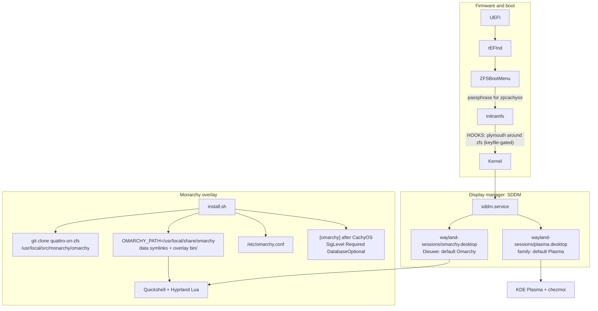

# Monarchy

Omarchy Quattro as a second Wayland session on CachyOS+ZFS+KDE. Plasma stays the family default. Dieuwe's user defaults to Omarchy at SDDM.

`install.sh` is the one-shot entry: packages, chezmoi, hardware, ZFS, then Monarchy apply. The library is `lib/monarchy/`. Policy files live in `monarchy/`.

| Doc | What it is |
| --- | --- |
| `docs/monarchy.md` | This file. How the overlay is put together. |
| `docs/monarchy-install.md` | Operator steps, apply checklist, rollback |
| `docs/monarchy-clashes.md` | `packages.deny`, overlay-bin, clash policy |
| `docs/boot-flow.md` | Firmware to greeter. Plymouth around zfs. |
| `docs/plans/` | Work that is not in the tree yet (ZBM UI, zbook fingerprint) |

## What it is

Household boxes run CachyOS on native-encrypted ZFS with KDE Plasma, rEFInd chainloading ZFSBootMenu, and a repeatable chezmoi install. That base does not change. Monarchy adds Omarchy Quattro (Hyprland 0.56 Lua + Quickshell) on top of it.

CachyOS owns the OS: kernel, ZFS modules, repos, Plasma, `cachy-update`, sanoid, ZBM. Monarchy owns the Hyprland session, the clash bridge, and branding. Omarchy never owns `pacman.conf`, the bootloader, or `/etc/os-release`.

The desktop comes from a pinned git clone of `berenddeboer/omarchy` branch `quattro-on-zfs`, plus official `[omarchy]` leaf packages. That fork is a real Omarchy+ZFS tree, but it encodes `zroot/ROOT/default`, Limine, archzfs, and a `pacman.conf` replacement. These machines will never match that contract. The fork is the desktop+script upstream, not an installer. Official Omarchy is Limine + Btrfs + a single-user greeter. Same problem.

Do not vendor-fork Omarchy. The overlay in this repo is what we maintain. If the fork stalls, re-pin. Do not start `dieuwedeboer/omarchy`.

## Architecture



Three layers:

1. Official `[omarchy]` appended after CachyOS. Pacman first-match keeps `hyprland`, `quickshell`, `linux`, and `zfs-utils` on CachyOS. Names that exist only in Omarchy (`omarchy-nvim`, `omarchy-keyring`, `omacalc`, …) come from `[omarchy]`.
2. A root-owned git clone plus a working prefix. Same idea as `omarchy-dev-link`, without installing `omarchy-dev`.
3. Never the metapackages. `omarchy`, `omarchy-dev`, `omarchy-settings`, and `omarchy-settings-dev` are in `packages.deny`. Settings files are copied from the clone minus `monarchy/settings.skip`.

Do not add `[omarchy-zfs]` or `[archzfs]`. Do not replace `/etc/pacman.d/mirrorlist` or any `cachyos-*-mirrorlist`.

### Clone and working prefix

| Path | Role |
| --- | --- |
| `/usr/local/src/monarchy/omarchy` | Root-owned clone of `berenddeboer/omarchy` `quattro-on-zfs` at the lock commit. Never on PATH. Never copied into `$HOME`. |
| `/usr/local/share/omarchy` | `OMARCHY_PATH`. What the session reads. |
| `/etc/omarchy.conf` | `OMARCHY_PATH=/usr/local/share/omarchy` |
| `/etc/omarchy.lock` | Copy of `monarchy/omarchy.lock` written at apply. `omarchy-version-branch` reads it. |
| `monarchy/omarchy.lock` | Pin: `remote`, `branch`, `commit`. Optional `hyprland` and `quickshell` keys for a recorded CachyOS version. |

`monarchy_link_working_prefix` symlinks `default`, `shell`, `themes`, `migrations`, `config`, `install`, `applications`, `version`, `logo.txt`, `logo.svg`, `icon.txt`, and `icon.png` into the working prefix. `bin/` is not a symlink. Apply then explodes `shell/` and `default/` so lock QML and `omarchy-menu.jsonc` can be patched copies. Clone `bin/` stays in the git tree.

env-bootstrap and `envs.lua` both prepend `$OMARCHY_PATH/bin`. That directory is the overlay. Putting clone `bin/` on PATH would skip it.

`/usr/share/uwsm/env.d/10-monarchy` is `monarchy/10-monarchy`. Do not install the clone's `default/uwsm/env.d/10-omarchy`. That file hardcodes `/usr/share/omarchy/default/bash/env-bootstrap`.

### Overlay bin

quattro-on-zfs `bin/` is 438 names at the current pin. Allow-default: every name except a short brick list and the wraps. `generate-inventories.py` rebuilds the three files so `allow ∪ wrap ∪ deny` is every `clone/bin/*` name.

| File | Meaning | Overlay action |
| --- | --- | --- |
| `monarchy/bin.allow` | Exact filenames, no globs | Symlink to clone `bin/<name>` |
| `monarchy/bin.wrap` | Exact filenames | Install a Monarchy wrapper |
| `monarchy/bin.deny` | Brick list | Stub, exit 2, log to `/var/log/monarchy-setup.log` |

`monarchy_rebuild_overlay` empties `$OMARCHY_PATH/bin`, installs deny stubs, allow symlinks, wrap scripts, and a `yay` wrapper that execs `paru`. The same names also land under `/usr/local/bin` so systemd user units and `sudo omarchy-pkg-add` resolve. Arch `secure_path` includes `/usr/local/bin`. Deny stubs still win for brick names. Apply also points `/usr/local/bin/setup-monarchy` at `install.sh`.

`bin/omarchy` is the CLI router. Overlay **symlinks** clone `bin/omarchy`. Wrapping `omarchy` itself would break every spaced command (`omarchy theme set`, `omarchy update`). `omarchy update` (two words) is the router calling `omarchy-update`. Only that binary is wrapped.

Wraps:

- `omarchy-update` / `omarchy-update-system-pkgs` → `install.sh --update`
- `omarchy-plymouth-set` / `omarchy-plymouth-reset` / `omarchy-refresh-plymouth` → Monarchy splash helpers (`mkinitcpio -P`, no Limine). plymouth-set restyles the greeter overlay.
- `omarchy-refresh-sddm` → copy clone theme, overlay `Main.qml`
- `omarchy-screensaver` → seed `screensaver.txt` from clone `logo.txt` if missing, then exec the clone binary
- `omarchy-version` / `omarchy-version-branch` / `omarchy-version-channel` → Fastfetch About. Version is `$OMARCHY_PATH/version` plus `-git`. Branch is the apply pin. Channel is the `[omarchy]` pkg repo. The clone is detached and root-owned, so these do not run `git`.

`omarchy-refresh-pacman` stays in `bin.deny`. Its contract is "replace pacman.conf". Redirecting it to `--update` would hide that.

`--check` / `--update` fail only on clone `bin/` names that are **new relative to the lock**. Reclassifying a name is a file edit, not a check failure.

After a lock bump:

```bash
python3 lib/monarchy/generate-inventories.py /usr/local/src/monarchy/omarchy
```

### Pacman

`monarchy_add_omarchy_repo` recvs packaging key `40DFB630FF42BCFFB047046CF0134EE680CAC571` from keys.openpgp.org (ubuntu keyserver fallback), prints the fingerprint, prompts once to locally sign, then installs standalone `omarchy-keyring`. Re-runs skip the prompt when the key is already signed. `MONARCHY_TRUST_OMARCHY_KEY=1` skips it. TrustAll is not accepted. If keyring import fails on CachyOS, that is a bug here, not a reason to fall back.

The repo is a marker block, replaced in place:

```ini
# BEGIN monarchy-omarchy
[omarchy]
SigLevel = Required DatabaseOptional
Server = https://pkgs.omarchy.org/stable/$arch
# END monarchy-omarchy
```

CachyOS does not Include drop-ins, so this lives in `pacman.conf` itself. First edit takes `/etc/pacman.conf.monarchy.bak`. `monarchy_preserve_pacman_conf` aborts if `[cachyos]` / `[cachyos-v3]` do not precede `[omarchy]`, or if the CachyOS/Arch mirrorlist Includes are gone.

`monarchy_install_packages` reads clone `install/omarchy-base.packages`, subtracts `monarchy/packages.deny`, `pacman -S --needed --noconfirm`, writes `monarchy/packages.installed` and `/var/lib/monarchy/packages.installed`. Do not install from `omarchy-other.packages`. Hardware stays CachyOS `chwd` plus `hardware/`.

`--update` is snapshot, fetch, `--check`, then apply. `--check` fails if `omarchy-base.packages` grew a row that is neither denied nor in `packages.installed`. Classify it before applying. Apply then installs the current filtered set with `--needed`.

## Apply

Entry point: `install.sh`. bash, `set -e`, idempotent, sudo only where needed. Bare invocation is the full setup, including Monarchy apply. Flags are Monarchy-only.

```bash
./install.sh --check   # Monarchy dry-run only. Writes nothing under /etc or /usr/local.
./install.sh           # packages, chezmoi, hardware, ZFS, Monarchy apply
./install.sh --update  # snapshot, fetch, check, apply
```

Invoked as `/usr/local/bin/setup-monarchy` (overlay symlink), a bare run is Monarchy apply, not the full bootstrap. That is what `omarchy-update` calls.

Snapshot-first always calls `sudo /root/.local/bin/zfs-snapshot-pre-update.sh`. That helper hard-codes `zpcachyos/ROOT/cos`. If it is missing or still has the varlog-only prune, apply installs the current copy from this repo, then asserts a `@pre-update-*` exists on `zpcachyos/ROOT/cos/root`. The pacman hook uses that installed helper.

`monarchy_apply` order: snapshot, guards, clone, working prefix, overlay, lock/menu patch, switch-user helper, `/etc/omarchy.conf`, `[omarchy]` repo, leaf packages, settings files, a short list of clone `install/config/*.sh`, SDDM, lock PAM, session desktop, logind, UWSM env, portals, Dieuwe user setup, mime assert, Plymouth.

Dieuwe-only user setup (`monarchy_setup_user`): seed `~/.config/hypr/*` if missing, Super+Ctrl+U bind, branding (`logo.txt` → `screensaver.txt`, `icon.txt` → `about.txt`), no `TERMINAL=` override, plugins from `monarchy/plugins`, `omarchy-refresh-applications` (mise agent stubs + webapps), `omarchy-pkg-add spotify`, `mise use -g bun`, `omarchy-emacs` (`emacs-wayland`, chezmoi `~/.config/emacs/`), mark first-run done. Does not copy `default/`, `shell/`, or `bin/` into the home directory. Quickshell is launched with `-p "$OMARCHY_PATH/shell"`.

`lib/packages.sh` installs the shared set before apply. After apply it strips competing copies (pacman emacs/bun/gh, Spotify/Discord flatpaks) once `/etc/omarchy.conf` exists, so a box that has not finished apply is still usable.

### Repo layout

```text
install.sh
lib/monarchy.sh          # sources the library
lib/monarchy/
  common.sh              # logging, snapshot-first, layout guards
  pacman.sh              # preserve CachyOS, append [omarchy]
  denylist.sh            # loads packages.deny, bin.*, migrations.deny
  overlay.sh             # rebuild overlay bin, explode-and-patch lock/menu
  overlay-lock.py        # Super+Ctrl+U hunks; --check fails if clone drifted
  switch-user.sh         # /usr/local/bin/monarchy-switch-user
  packages.sh            # filtered install, writes packages.installed
  plugins.sh             # third-party omarchy plugin clone+enable
  clone.sh               # sync clone, working prefix, /etc/omarchy.conf
  sessions.sh            # omarchy.desktop, AccountsService, hide stock Hyprland
  settings.sh            # omarchy-settings file tree minus settings.skip
  sddm.sh                # enable sddm, remove PLM, overlay greeter QML
  sddm-resume.sh         # greeter asks this before sddm.login()
  session-probe.sh       # Exec= fallback if hyprland.desktop is missing
  portals.sh
  splash.sh              # Omarchy plymouth, plymouth around zfs, retain-splash
  update.sh              # --check, apply, --update
  user.sh
  stubs/                 # deny, wrap-update, wrap-plymouth, wrap-sddm, …
monarchy/
  omarchy.lock
  packages.deny
  packages.installed
  plugins
  bin.allow
  bin.wrap
  bin.deny
  migrations.deny
  settings.skip
  omarchy.desktop
  10-monarchy
  hyprland-portals.conf
  sddm/                  # Main.qml, zz-omarchy-sddm.conf, hyprland.lua
  hypr/boot-color.lua
  logind/
```

### Guards

These abort apply or check when the host has drifted. Full clash rows are `docs/monarchy-clashes.md`.

| Function | What it does |
| --- | --- |
| `monarchy_assert_zfs_layout` | `/` is ZFS and `zpcachyos/ROOT/cos/root` (or `$MONARCHY_ROOT_DATASET`). Refuse Btrfs/ext4. Refuse `zroot/ROOT/default`. |
| `monarchy_preserve_pacman_conf` | CachyOS repos stay above `[omarchy]`. Mirrorlist Includes still exist. Never copy Omarchy `pacman-*.conf`. |
| `monarchy_add_omarchy_repo` | Recv+lsign key once. Marker-block append. `omarchy-keyring`. `pacman -Sy`. |
| `monarchy_refuse_archzfs` | Fail if `[archzfs]` appears. |
| `monarchy_refuse_omarchy_zfs_repo` | Fail if `[omarchy-zfs]` is present. |
| `monarchy_refuse_kernel_swap` | Never install `linux` / `linux-headers`. Running pkgbase is `linux-cachyos*`. |
| `monarchy_refuse_bootloader` | rEFInd at `/boot/efi/EFI/refind`, ZBM at `/boot/efi/EFI/zbm`. Refuse `limine*`. |
| `monarchy_refuse_snapper` | Refuse `snapper`. Keep sanoid + pacman hook. |
| `monarchy_refuse_dataset_rename` | Never run clone `install/config/zfs.sh`. Never write `/etc/pam.d/zfs-key`. |
| `monarchy_disable_omarchy_update_guard` | Never install `omarchy` / `omarchy-dev`. Mask the ALPM hook if it appears. |
| `monarchy_skip_os_release_clobber` | Never install `omarchy-settings*`. If `ID` is not `cachyos`, abort and restore from `/usr/lib/os-release`. |
| `monarchy_skip_plymouth_zfs` | Never install AUR `plymouth-zfs`. plymouth-before-zfs only when the keyfile is in FILES. |
| `monarchy_skip_autologin` | Autologin User empty in leftover plasmalogin and sddm conf. |
| `monarchy_keep_family_mime` | No Omarchy mimeapps system-wide or in `~/.config/mimeapps.list`. |
| `monarchy_keep_sddm` | Enable `sddm`, remove `plasma-login-manager`, write `zz-omarchy-sddm.conf`, overlay `Main.qml`. |
| `monarchy_nvidia_keep_chwd` | Never run Omarchy `nvidia.sh`. Lives in `pacman.sh`. Apply does not call it. |

Install scripts the bridge never invokes, even when a binary of the same name is allowlisted: `install/helpers/pacman.sh`, `install/post-install/pacman.sh`, `install/config/zfs.sh`, snapper, enable-services, firewall, increase-lockout-limit, nvidia, intel ptl-kernel, network, tuxedo backlight, hardware/pacman, `install/user/all.sh`. `install/config/lockscreen-pam.sh` is invoked as overlay `omarchy-apply-lock`.

`omarchy-provision-first-run` is allowlisted. Apply seeds `~/.local/state/omarchy/first-run-user` so a later run no-ops.

`monarchy/migrations.deny` is pre-seeded (all five call `limine-mkinitcpio`). `--check` also fails any migration body that matches `limine-mkinitcpio`, `omarchy-refresh-pacman`, or `use_omarchy_pacman_config`.

## Greeter

SDDM runs the Omarchy theme with a Monarchy overlay. plasma-login-manager cannot load that QML, so it is removed. Two display managers on one seat is a brick.

Stock Omarchy `Main.qml` is a last-user password box that auto-picks the first `uwsm` session. That logs Amie into Dieuwe's account. `monarchy/sddm/Main.qml` keeps the logo/lock/entry and `#1a1b26` / `#ffffff` tokens, and adds Tab (users) and Up/Down (sessions). amie and olivier default to Plasma. Everyone else defaults to Omarchy.

Do not write `/var/lib/sddm/state.conf`. Do not enable Autologin. SDDM's `RememberLastSession` is one slot for the whole machine, not per user. The overlay's static defaults are the picker.

CachyOS leftover `/etc/sddm.conf.d/kde_settings.conf` has `Current=breeze`. SDDM drop-ins are lexicographic, so `99-omarchy-sddm.conf` loses to `kde_settings.conf` (`k` > `9`). The drop-in is `zz-omarchy-sddm.conf`. Apply asserts effective `Theme.Current` is `omarchy`.

| File | Policy |
| --- | --- |
| `/usr/share/wayland-sessions/omarchy.desktop` | From `monarchy/omarchy.desktop`. `TryExec=uwsm`. `DesktopNames=Hyprland`. Apply rewrites `Exec=` to `uwsm start -g -1 -e -D Hyprland hyprland.desktop` once that file exists, otherwise `monarchy-session-probe`. |
| `/usr/share/wayland-sessions/plasma.desktop` | Untouched |
| `/usr/share/wayland-sessions/hyprland.desktop` | Left on disk (`uwsm start … hyprland.desktop` refuses `Hidden=true`). `NoDisplay=true` so SDDM does not list it. Same for `hyprland-uwsm.desktop`. |
| `/etc/sddm.conf.d/zz-omarchy-sddm.conf` | `Current=omarchy`. Wayland greeter. `CompositorCommand=start-hyprland -- --config /usr/share/sddm/hyprland.lua`. Autologin User empty. |
| `/usr/share/sddm/themes/omarchy/Main.qml` | Clone theme, then Monarchy overlay. Wrapped `omarchy-refresh-sddm` cannot land stock last-user QML. Fresh apply is Unlock default (`#1a1b26`). Style > Unlock restyles plymouth and the greeter together. Session theme does not. |
| `/usr/share/sddm/hyprland.lua` | Overlay `monarchy/sddm/hyprland.lua` (`background_color` `#1a1b26`) |
| `/var/lib/AccountsService/users/{dieuwe,amie,olivier}` | `Session=` written. The QML overlay is the picker default that matters. |
| leftover `/etc/sddm.conf.d/kde_settings.conf` | Assert Autologin User empty. Do not delete. `zz-` sorts after it. |

```mermaid
sequenceDiagram
  participant User
  participant SDDM as sddm
  participant Plasma as startplasma-wayland
  participant Omarchy as uwsm + Hyprland + Quickshell
  User->>SDDM: user + session (Tab / Up Down)
  alt family user, Plasma
    SDDM->>Plasma: plasma.desktop
    Plasma->>Plasma: XDG_CURRENT_DESKTOP=KDE, portal=kde
  else Dieuwe, Omarchy
    SDDM->>Omarchy: omarchy.desktop
    Omarchy->>Omarchy: XDG_CURRENT_DESKTOP=Hyprland, portal=hyprland;gtk
  end
```

Family members see the Omarchy terminal-style greeter with their name and Plasma on screen. Tab if the last user was someone else. After login they still get full Plasma. `sddm-kcm` may stay. A monarchy apply puts `Current=omarchy` back.

Switch user is Super+Ctrl+U in both places: the System menu / Hyprland bind (session unlocked) and the Omarchy lock screen (family, no password). Both run `/usr/local/bin/monarchy-switch-user`, which takes `ext-session-lock` if the session is unlocked, waits until it is held, then calls SDDM `Seat.SwitchToGreeter`. Do not `sddm.login()` for a user who already has a Wayland session. That starts a second compositor and has hard-crashed this machine. The greeter asks `monarchy-sddm-resume` first (localhost Image GET). A hit `loginctl activate`s the existing session and leaves the greeter up. Miss falls through to `sddm.login()` for a fresh user. `--check` fails if the lock QML or `system.lock` menu hunk no longer matches the clone.

No autologin. ZFS passphrase is at ZBM. User password is at the greeter.

Mime: do not copy Omarchy `mimeapps.list` into `~/.config`. Nautilus is installed for Hyprland keybinds. Plasma keeps Dolphin as `inode/directory`. Keep all KDE packages.

Both portals are installed. Selection is session-scoped via `XDG_CURRENT_DESKTOP`. Plasma uses the existing kde portal. Omarchy uses `/usr/share/xdg-desktop-portal/hyprland-portals.conf` (`default=hyprland;gtk`). Do not set those env vars in a systemd user environment that would leak into Plasma.

`/usr/share/uwsm/env.d/10-monarchy` is the file in `monarchy/10-monarchy`: source env-bootstrap from the working prefix, then `default/uwsm/default` (Omarchy `TERMINAL=xdg-terminal-exec`), then mise shims.

## Boot

Passphrase stays in ZFSBootMenu. Plymouth is the Omarchy theme on the host initramfs. It sits **before** zfs when `/etc/zfs/zroot.key` is in mkinitcpio FILES, otherwise **after**. Never `plymouth-zfs`. Never Limine. Quiet cmdline tokens come from `lib/zfs.sh`. rEFInd stays glow.

`omarchy-plymouth-set` restyles the SDDM greeter from the same Unlock tokens. `plymouth quit --retain-splash` so SDDM paints over the last frame, not a tty.

Details and remaining ZBM UI work: `docs/boot-flow.md`.

| Asset | Repo path | Deploy path | Deployed by |
| --- | --- | --- | --- |
| Plymouth theme | clone `default/plymouth/` | `/usr/share/plymouth/themes/omarchy/` | `monarchy_splash` |
| SDDM theme | clone `default/sddm/omarchy/` plus `monarchy/sddm/Main.qml` | `/usr/share/sddm/themes/omarchy/` | `monarchy_refresh_sddm` |
| SDDM conf | `monarchy/sddm/zz-omarchy-sddm.conf` | `/etc/sddm.conf.d/zz-omarchy-sddm.conf` | `monarchy_keep_sddm` |
| Session desktop | `monarchy/omarchy.desktop` | `/usr/share/wayland-sessions/omarchy.desktop` | `monarchy_install_omarchy_session` |
| Dieuwe branding | clone `logo.txt` → `screensaver.txt`, `icon.txt` → `about.txt` | `~/.config/omarchy/branding/` | `monarchy_setup_user` |

## On disk after apply

ZFS datasets do not change: `zpcachyos/ROOT/cos/{root,home,varcache,varlog}`. Pool-level encryption already covers `/home`. Do not migrate onto PAM `zroot/data/home/$user`.

| Path | Purpose |
| --- | --- |
| `/etc/pacman.conf` marker block | `[omarchy]`, `SigLevel = Required DatabaseOptional` |
| `/etc/pacman.conf.monarchy.bak` | Backup before first edit |
| `/etc/omarchy.conf` | `OMARCHY_PATH=/usr/local/share/omarchy` |
| `/etc/omarchy.lock` | Apply pin. `omarchy-version-branch` reads it |
| `/etc/pam.d/omarchy-lock-password` | Quickshell lock PAM. Super+Ctrl+L is a no-op without it |
| `/usr/local/src/monarchy/omarchy` | git clone |
| `/usr/local/share/omarchy` | working prefix: data symlinks + overlay `bin/` |
| `/usr/local/bin/omarchy-*` | allow symlinks, wraps, and deny stubs |
| `/usr/local/bin/monarchy-switch-user` | lock if needed, then return to SDDM |
| `/usr/local/bin/setup-monarchy` | symlink to `install.sh` |
| `/etc/systemd/logind.conf.d/10-monarchy-ignore-power-button.conf` | `HandlePowerKey=ignore`. A Bluetooth headset KEY_POWER has shut a host down. Shutdown is the System menu. |
| `/usr/share/uwsm/env.d/10-monarchy` | working-prefix bootstrap + mise |
| `/usr/share/plymouth/themes/omarchy/` | Omarchy Plymouth theme |
| `~/.config/omarchy/plugins/<id>/` | User plugin checkouts. Not chezmoi. Dieuwe only. |
| `/root/.local/bin/zfs-snapshot-pre-update.sh` | snapshot helper. Required. |
| `/var/log/monarchy-setup.log` | setup + stub invocations |

## Updates

| Updater | Owns | Must not |
| --- | --- | --- |
| `cachy-update` / `pacman -Syu` | CachyOS kernel, ZFS modules, Plasma, already-installed leaf packages | Be aborted by omarchy-update-guard. Swap kernel. Drop `[cachyos*]`. Replace mirrorlist. |
| `./install.sh --update` | Fetch quattro-on-zfs, dry-run vs lock inventories, overlay rebuild, filtered leaf packages, user/session/splash | Call `omarchy-refresh-pacman`. Unfiltered `-Syyuu`. Fast-forward past `bin/` names new to the lock. |

Channel: `[omarchy]` **stable**. Clone follows `quattro-on-zfs`. Those two are allowed to differ. Hyprland and Quickshell stay on CachyOS first-match. Do not pull them from `[omarchy]` to "catch up."

Rollback: boot `zpcachyos/ROOT/cos/root@pre-update-*` from ZFSBootMenu, or clone+promote. Pacman.conf backup is `/etc/pacman.conf.monarchy.bak`. There is no `--uninstall`.

## What we refuse

- Omarchy ISO, dual-booting two roots, or renaming datasets to `zroot/ROOT/default`
- `linux` / `linux-headers`, archzfs, Limine, Snapper, `limine-snapper-sync`
- Removing `linux-cachyos-zfs` or `zfs-dkms`. CachyOS Calamares installs both.
- Removing Plasma. Seamless-login / autologin / Omarchy "direct boot"
- Plymouth owning the ZFS unlock prompt
- Changing family users' shells, file manager, or Plasma look
- Hibernation (Omarchy's setup is Btrfs+Limine only)
- A custom ISO
- `[omarchy]` TrustAll

The fork still hardcodes `zroot/ROOT/default` and Limine. That is why the denylist exists. The ask is https://github.com/berenddeboer/omarchy-zfs-pkgs/issues/1 (`berenddeboer/omarchy` has issues disabled). PAM homes, a plymouth-before-zfs mkinitcpio rewrite, and archzfs stay refused even if that lands.

NVIDIA and Tuxedo/Clevo quirks stay in `hardware/system76-bonw9/apply.sh` / `chwd`. Dieuwe's fish, paru, tealdeer, chezmoi nvim, ghostty, docker group, and per-box ufw enable/disable stay.
