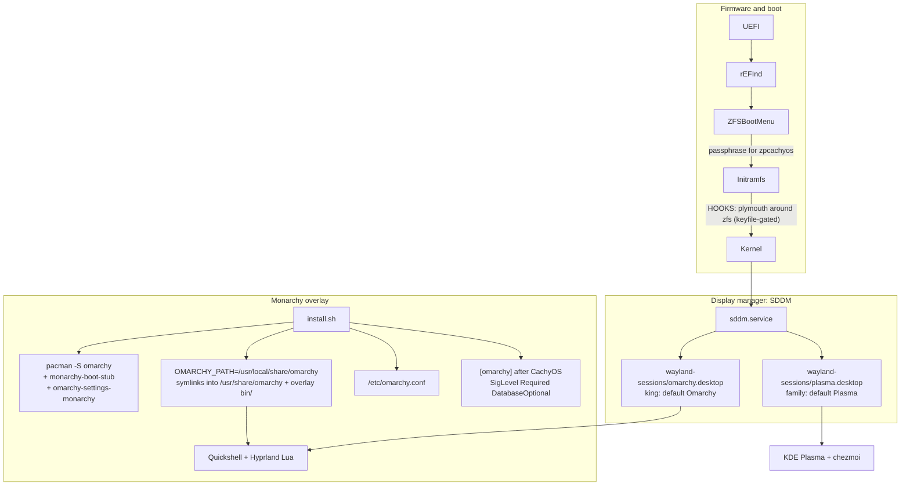

# Monarchy

Omarchy Quattro as a second Wayland session on CachyOS+ZFS+KDE. Plasma stays the family default. The king's user defaults to Omarchy at SDDM.

`install.sh` is the one-shot entry: packages, chezmoi, hardware, ZFS, then Monarchy apply. The library is `lib/monarchy/`. Policy files live in `monarchy/`.

| Doc | What it is |
| --- | --- |
| `docs/monarchy.md` | This file. How the overlay is put together. |
| `docs/monarchy-install.md` | Operator steps, apply checklist, rollback |
| `docs/monarchy-clashes.md` | `packages.deny`, overlay-bin, clash policy |
| `docs/boot-flow.md` | Firmware to greeter. Plymouth around zfs. |
| `docs/plans/` | Work that is not in the tree yet (extra themes, ZBM UI, zbook fingerprint) |

## What it is

Household boxes run CachyOS on native-encrypted ZFS with KDE Plasma, rEFInd chainloading ZFSBootMenu, and a repeatable chezmoi install. That base does not change. Monarchy adds Omarchy Quattro (Hyprland 0.56 Lua + Quickshell) on top of it.

CachyOS owns the OS: kernel, ZFS modules, repos, Plasma, `cachy-update`, sanoid, ZBM. Monarchy owns the Hyprland session, the clash bridge, and branding. Omarchy never owns `pacman.conf`, the bootloader, or `/etc/os-release`.

The desktop comes from the official `omarchy` package, plus two packages built here: `monarchy-boot-stub` and `omarchy-settings-monarchy`. There is no fork and no clone.

### Where the desktop comes from

The `[omarchy]` repository, channel **stable**. `monarchy/omarchy.lock` names `package=omarchy` and `channel=stable`, and pacman does the version pinning from there. Read that as: there is no git remote to follow, no commit pinned, and nothing to re-pin. `monarchy-update` installs whatever that channel currently carries and halts on a new binary or migration it cannot classify, which is the human step that used to be a pin bump.

Anything describing how to move this repo onto a newer upstream *commit* — a note, a skill, a stale paragraph — is describing the arrangement below, which ended. Check `monarchy/omarchy.lock` before believing it.

### What came before

Until the move to the packages, it was a pinned git clone of `berenddeboer/omarchy` branch `quattro-on-zfs`. Measured against official Omarchy 4.0.2, that fork was 403 of 428 shared `bin/` names byte-identical, 25 changed, 14 added, and 0 official names missing. Of the changes, exactly two carried ZFS logic: `omarchy-upgrade-to-quattro` and `omarchy-snapshot`. The first was already denied; the second is now `monarchy/bin.wrap` + `stubs/wrap-snapshot.sh`. Everything else the fork changed was personal preference, and everything it encodes about ZFS (`zroot/ROOT/default`, Limine, archzfs, a `pacman.conf` replacement) these machines refuse anyway.

`berenddeboer/omarchy-zfs-pkgs` does not help either: its `omarchy-settings-dev.install` is upstream's byte-for-byte where it matters (`rm -f /etc/os-release` and the five unconditional `cp -f` into `/etc`), and its `omarchy-dev` hard-depends on all four of limine, limine-mkinitcpio-hook, limine-snapper-sync and snapper. That is correct for a box where Omarchy *is* the OS. It is the opposite of what this repo needs.

Do not vendor-fork Omarchy. Do not re-add a clone. Do not re-add a pin. The overlay in this repo is what we maintain, on top of whatever `[omarchy]` stable ships.

## Architecture



Three layers:

1. Official `[omarchy]` appended after CachyOS. Pacman first-match keeps `hyprland`, `quickshell`, `linux`, and `zfs-utils` on CachyOS. Names that exist only in Omarchy (`omarchy-nvim`, `omarchy-keyring`, `omacalc`, …) come from `[omarchy]`.
2. The official `omarchy` package, plus a working prefix of symlinks into the tree it owns. Same idea as `omarchy-dev-link`, without installing `omarchy-dev`.
3. Two local packages, not a denylist. `omarchy` is installed. `omarchy-settings` is replaced by `omarchy-settings-monarchy`; `limine*` and `snapper` are satisfied by `monarchy-boot-stub`. `omarchy-dev`, `omarchy-settings` and `omarchy-settings-dev` stay in `packages.deny`.

Do not add `[omarchy-zfs]` or `[archzfs]`. Do not replace `/etc/pacman.d/mirrorlist` or any `cachyos-*-mirrorlist`.

### Package tree and working prefix

| Path | Role |
| --- | --- |
| `/usr/share/omarchy` | Owned by `omarchy` + `omarchy-settings-monarchy`. Never written to. A symlink here aborts the pacman transaction, so apply removes a leftover one before installing. |
| `/usr/local/share/omarchy` | `OMARCHY_PATH`. What the session reads. |
| `/etc/omarchy.conf` | `OMARCHY_PATH=/usr/local/share/omarchy` |
| `/etc/omarchy.lock` | Copy of `monarchy/omarchy.lock` written at apply. `omarchy-version-branch` reads it. |
| `monarchy/omarchy.lock` | `package` and `channel`. Pacman does the version pinning now. |

`monarchy_link_working_prefix` symlinks `default`, `shell`, `themes`, `migrations`, `config`, `install`, `applications`, `version`, `logo.txt`, `logo.svg`, `icon.txt`, and `icon.png` into the working prefix. `omarchy` ships six of those names and `omarchy-settings-monarchy` the other six, so the set is complete without a clone. `bin/` is not a symlink. Apply then explodes `shell/` and `default/` so lock QML, the power panel, `omarchy-menu.jsonc` and `launcher.hides` can be patched copies — a pacman-owned path is not somewhere to write, because the next upgrade would silently revert them.

env-bootstrap and `envs.lua` both prepend `$OMARCHY_PATH/bin`. That directory is the overlay: a full mirror of the packaged `bin/`, with Monarchy's stubs and wraps over the names we override.

`/usr/share/uwsm/env.d/10-monarchy` is `monarchy/10-monarchy`. Do not install the package's `default/uwsm/env.d/10-omarchy`. That file hardcodes `/usr/share/omarchy/default/bash/env-bootstrap`.

### Overlay bin

The overlay mirrors every packaged name. There is still no allow list: what a name gets is decided by `bin.wrap` and `bin.deny`, not by being listed.

`omarchy` installs its 428 binaries into `/usr/bin`, with `/usr/share/omarchy/bin/` as symlinks to them. `$OMARCHY_PATH/bin` and `/usr/local/bin` both precede `/usr/bin` on PATH and in sudo's `secure_path`, so a stub or a wrap wins on PATH alone. That is what retired `monarchy/bin.allow` (438 rows) and `lib/monarchy/generate-inventories.py`.

Retiring the allow list is not a reason to stop mirroring, and for one release it was taken as one. `$OMARCHY_PATH/bin` is an advertised path, not just a PATH element — packaged scripts resolve siblings through it absolutely, and so does `lib/monarchy/plugins.sh`:

| Caller | Absolute reference |
| --- | --- |
| `omarchy-system-sleep-monitor` | `$OMARCHY_PATH/bin/omarchy-system-sleep-{monitor,lock}` |
| `omarchy-install-chromium-ytdlp` | `$OMARCHY_PATH/bin/omarchy-chromium-ytdlp-host` |
| `omarchy-install-chromium-copy-url` | `$OMARCHY_PATH/bin/omarchy-chromium-copy-url-host` |
| `monarchy_validate_plugin_dir` | `$MONARCHY_PATH/bin/omarchy-plugin-validate` |
| `monarchy_install_plugins` | `$MONARCHY_PATH/bin/omarchy-shell` |

A sparse overlay broke all five silently. The one that mattered was the first: `omarchy-sleep-lock.service` re-execs itself through `OMARCHY_PATH`, so it exited 1 on every start, restarted on a two-second loop, and never held logind's delay inhibitor. Suspends that did not come from the awake lid-close binding left the session unlocked, and nothing reported it. Mirroring costs 441 symlinks.

| File | Meaning | Overlay action |
| --- | --- | --- |
| `monarchy/bin.wrap` | Exact filenames | Install a Monarchy wrapper |
| `monarchy/bin.deny` | Brick list | Stub, exit 2, log to journald (`journalctl -t monarchy`) and, for the administrator, to `/var/log/monarchy-setup.log` |
| anything else | Not overridden | Symlink onto `/usr/share/omarchy/bin/<name>` |

`monarchy_rebuild_overlay` empties `$OMARCHY_PATH/bin`, mirrors the packaged `bin/` with `cp -srT`, then installs deny stubs, wrap scripts, and a `yay` wrapper that execs `paru` over the top. Mirror first: `install(1)` unlinks its destination before writing, so a stub replaces the symlink instead of writing through it into the pacman-owned `/usr/bin`. The same names also land under `/usr/local/bin` so systemd user units and `sudo omarchy-pkg-add` resolve. `monarchy_prune_stale_overlay_links` removes `/usr/local/bin/omarchy` and `omarchy-*` symlinks left by the clone era: a dangling entry there would shadow the real `/usr/bin` one. The glob was `omarchy-*` for one release and so never matched the bare router, which outlived every prune still pointing into the clone. Only symlinks are pruned; everything apply installs there is a real file. Apply points `/usr/local/bin/monarchy-update` at `install.sh` and removes leftover `setup-monarchy`.

`bin/omarchy` is the CLI router and is **not** overridden. Wrapping `omarchy` itself would break every spaced command (`omarchy theme set`, `omarchy update`). `omarchy update` (two words) is the router calling `omarchy-update`. Only that binary is wrapped.

Wraps:

- `omarchy-update` / `omarchy-update-system-pkgs` → `monarchy-update`. The Omarchy menu still calls these names. The command to type is `monarchy-update`.
- `omarchy-plymouth-set` / `omarchy-plymouth-reset` / `omarchy-refresh-plymouth` → Monarchy splash helpers (`mkinitcpio -P`, no Limine). plymouth-set restyles the greeter overlay.
- `omarchy-refresh-sddm` → copy the package theme, overlay `Main.qml`
- `omarchy-screensaver` → seed `screensaver.txt` from `logo.txt` if missing, then exec the packaged binary
- `omarchy-display-text-size` → packaged binary, then `omarchy-hook display-text-size`. Chezmoi `hooks/apply-font-size` reads `~/.config/environment.d/monarchy.conf` (`MONARCHY_FONT_PT_OFFSET`, `MONARCHY_ALPHA`) and runs `hooks/font-size.d/*` plus `hooks/alpha.d/*` (foot, Alacritty, Emacs, …)
- `omarchy-disk-speedtest` → packaged binary behind a `findmnt` shim. It resolves the target directory to a `/dev` node and samples that device's `/sys` counters; on ZFS `findmnt` names the dataset, so the test stops at "Cannot find a disk". The shim answers that one lookup with the pool's single data vdev. Multi-device pools are refused rather than measured one disk short.
- `omarchy-snapshot` → `zfs-snapshot-pre-update.sh` for `create`; `restore` points at ZFSBootMenu and exits 2. Stock drives snapper and `limine-snapper-restore`, and would exit 127 here because `monarchy-boot-stub` ships no snapper binary. This is the one script `berenddeboer/omarchy` genuinely improved, kept without the fork.
- `omarchy-version` / `omarchy-version-branch` / `omarchy-version-channel` → Fastfetch About. Version is `pacman -Q omarchy`. Stock does the same, but only when `OMARCHY_PATH` is `/usr/share/omarchy`; against a working prefix it decides it is a dev-link and prints `dev`. `$OMARCHY_PATH/version` is not the answer either: the 4.0.2 package still ships a version file reading `4.0.0.alpha`. Branch exits 1 — there is no branch when you track a package, and Fastfetch omits the line, which is what stock does with no dev-link git branch. Channel is the `[omarchy]` pkg repo.
- `omarchy-voxtype-config` → the bar's Dictate indicator. Stock opens `voxtype configure` and restarts the shell even when voxtype is not installed. Apply also marks first-run done without the voxtype invitation, so a fresh session always hits that path. The wrap sends the click to `omarchy-voxtype-install` instead.
- `omarchy-battery-status` → packaged binary, then fill in a blank time estimate from `$OMARCHY_POWER_SUPPLY_PATH`, and word it "to full" when that tree says the pack is charging. Stock takes the wording from UPower's state and gives "left" to anything that is not `charging`, which includes the `pending-charge` an EC that pulses the charge sits in most of the time. Stock takes "time to empty" from `upower -i` alone, and UPower has no time to give when it has no energy-rate. The ZBook's EC reports ACPI `_BST` Present Rate as unknown while discharging, so the panel's "Time left" row is an em dash on battery and a real figure on AC. `hardware/hp-zbook` already publishes a synthetic `power_now`; the wrap does the division UPower cannot. It fires only on an empty field, so on a machine where UPower answers the output is byte-identical to stock.

`omarchy-refresh-pacman` stays in `bin.deny`. Its contract is "replace pacman.conf". Redirecting it to `--update` would hide that.

`monarchy_check_bin_hazards` greps the package `bin/` for the things that actually brick this host — `limine-entry-tool`, `limine-mkinitcpio`, `limine-install`, `limine-snapper`, `omarchy-refresh-pacman`, `use_omarchy_pacman_config`, a `pacman-*.conf`, `zroot/ROOT`, `/etc/pam.d/zfs-key`, or a `snapper` invocation — and fails on any hit that is neither denied nor wrapped. Same shape as `monarchy_check_migrations`.

Matching on content rather than on a list of names is both smaller and stronger: an allow list cannot notice a hazard that arrives under a *renamed* binary, and this does. `monarchy_check_overrides_exist` is the other half — a wrap or deny for a name upstream dropped is dead weight that would hide exactly that rename.

There is nothing to regenerate after an upgrade. Classify a reported name into `monarchy/bin.deny` or `monarchy/bin.wrap` and re-run.

### Launcher hides

`AppLibrary.qml` reads exactly one path, `$OMARCHY_PATH/default/omarchy/launcher.hides`, and hides every desktop id listed in it. There is no user-level override and no second file it merges, so putting an application back in the launcher means owning that file. `monarchy/launcher.unhides` names what to put back.

The overlay is **subtractive**, not a replacement. `monarchy_overlay_launcher_hides` copies the packaged list, drops the names in `launcher.unhides` with a single `grep -vxF -f`, and writes the rest into the exploded `default/omarchy/`. A row a later Omarchy release adds still hides, which a Monarchy-owned list would have quietly stopped doing. Same reason `bin.wrap` is not an allow list: the interesting case is the name that arrives *after* the decision was made.

`monarchy_check_launcher_unhides` fails when a row is no longer in the packaged list. A name upstream stops hiding makes the row a no-op, and a no-op row is indistinguishable from one that works — the same rot `monarchy_check_overrides_exist` catches for a dropped binary, and `monarchy_check_applications_drop` for a dropped `.desktop`. It runs in `monarchy_classify_check`, so an update refuses before apply rather than after.

`libreoffice-fresh` is the case it was written for. The package ships all six applications and Omarchy shows three; `base`, `draw` and `math` are unhidden. Base additionally wants a `java-runtime` for its default HSQLDB engine, which is a package to install, not something the launcher can fix.

### Pacman

`monarchy_add_omarchy_repo` recvs packaging key `40DFB630FF42BCFFB047046CF0134EE680CAC571` from keys.openpgp.org (ubuntu keyserver fallback), prints the fingerprint, prompts once to locally sign, then installs standalone `omarchy-keyring`. Re-runs skip the prompt when the key is already signed. `MONARCHY_TRUST_OMARCHY_KEY=1` skips it. TrustAll is not accepted. If keyring import fails on CachyOS, that is a bug here, not a reason to fall back.

The repo is a marker block, replaced in place:

```ini
# BEGIN monarchy-omarchy
[omarchy]
SigLevel = Required DatabaseOptional
Server = https://pkgs.omarchy.org/stable/$arch
# END monarchy-omarchy
```

CachyOS does not Include drop-ins, so this lives in `pacman.conf` itself. First edit takes `/etc/pacman.conf.monarchy.bak`. `monarchy_preserve_pacman_conf` aborts if `[cachyos]` / `[cachyos-v3]` do not precede `[omarchy]`, or if the CachyOS/Arch mirrorlist Includes are gone.

`monarchy_install_packages` reads `install/omarchy-base.packages` from the package tree, subtracts `monarchy/packages.deny`, `pacman -S --needed --noconfirm`, writes `monarchy/packages.installed` and `/var/lib/monarchy/packages.installed`. Do not install from `omarchy-other.packages`. Hardware stays CachyOS `chwd` plus `hardware/`.

`--update` is snapshot, fetch, classify, then apply. `monarchy_classify_check` fails if `omarchy-base.packages` grew a row that is neither denied nor in `packages.installed`. Classify it before applying. Apply then installs the current filtered set with `--needed`.

### Packages

Two PKGBUILDs in `pkgbuilds/`, built and installed by `lib/monarchy/pkgbuild.sh` as the `packaging` unit. Together they make `pacman -S omarchy` a normal install on this host.

**`monarchy-boot-stub`** provides *and* conflicts with `limine`, `limine-mkinitcpio-hook`, `limine-snapper-sync` and `snapper`. It owns no files. `provides` is what lets `omarchy`'s hard deps resolve; `conflicts` is what stops a later `pacman -S` quietly landing the real ones.

Only one of those four is genuinely dangerous. `limine-mkinitcpio-hook` ships `/etc/pacman.d/hooks/90-mkinitcpio-install.hook`, and `HookDir` takes precedence over `/usr/share/libalpm/hooks`, so it **shadows the stock mkinitcpio hook by filename**. Every kernel, DKMS and ZFS-module update would then route through `limine-mkinitcpio-install`, which calls `limine-entry-tool --add-kernel` and writes into `$ESP_PATH`. This box boots rEFInd → ZFSBootMenu; that ESP is not Limine's to manage. `limine` alone depends only on glibc, and `snapper` ships an empty `/etc/snapper/configs` with timers that are not enabled — both are inert, and are stubbed only so the refuse list stays true as written.

**`omarchy-settings-monarchy`** is the official `omarchy-settings` package, rebuilt with its scriptlet dropped and the paths in `monarchy/settings.skip` removed. Everything else stays byte-identical to upstream, so there is no fork here either — only an exclude list.

Upstream's `post_install`/`post_upgrade` is destructive by design, and says so in its own comment. On every install *and* upgrade it runs `rm -f /etc/os-release` and then overwrites `/etc/os-release`, `/etc/security/faillock.conf`, `/etc/nsswitch.conf`, `/etc/plymouth/plymouthd.conf` and `/etc/skel/.bashrc` from `usr/share/omarchy/etc-overrides/`. Dropping the scriptlet and that staged tree is the whole point of the package. Note that those five paths are **not** in `settings.skip`: they are not files in the package, so there is nothing to exclude — killing the scriptlet is what protects them.

`pkgver` tracks whatever `omarchy` currently depends on. `omarchy` declares `omarchy-settings=<exact>`, so `monarchy_ensure_settings_pkg` reads that, downloads the matching official package straight from `[omarchy]`, verifies the signature against pacman's keyring, and rebuilds. Nothing to bump by hand; a mismatch between the repo and the dep is a hard error telling you to update first.

`pacman -Sw omarchy-settings` cannot be used to fetch it, because our replacement conflicts with that name and resolution refuses before downloading. Hence the direct fetch — and hence the explicit `gpg --verify`, since `SigLevel` for `[omarchy]` is `Required` and bypassing pacman must not also bypass the signature.

## Apply

Entry point: `install.sh` — argument parsing and dispatch only; the household half is `lib/household.sh`. bash, `set -e`, idempotent, sudo only where needed. One pipeline: household refresh (packages, chezmoi, hardware, ZFS), then Monarchy. `--check`, `--splash-only`, and `--only` skip the household refresh; `--update` does not.

A run prints one step per household stage and per Monarchy unit (`[ 7/12] sddm`), detail lines indented beneath, and an elapsed figure for any unit over five seconds. `-v` restores the timestamped `monarchy_log` form. It ends with a summary from an `EXIT` trap — so a run that dies partway still reports it — listing what changed, what was **left alone**, and what warned. `NO_COLOR` and a missing tty both drop the escapes.

Two things the household half does exactly once per run. **One transaction per
package manager**: the absent set is worked out first and handed to `pacman`,
`paru` or `flatpak` in a single call, so a step that is usually a no-op stops
costing forty dependency resolutions and forty screens of output. The summary
bullet names the first six and counts the rest; the log line has them all.
**One `chezmoi apply`**: `lib/zfs.sh` used to run a second one for the zpool
sensor `household_chezmoi` had already written, which doubled the slowest step
and gave a menu-driven update a second chance to hang on a prompt. It now
checks for `~/.local/share/ksystemstats-scripts/ZFS` and restarts ksystemstats
only when that apply actually wrote something.

```bash
./install.sh           # first run: household refresh, then Monarchy apply
                       # after /etc/omarchy.conf exists: same as --update
./install.sh --check   # Monarchy dry-run. Writes nothing under /etc or /usr/local.
./install.sh --update  # household refresh, then snapshot, fetch, classify, apply
monarchy-update        # this file with --update
```

`/usr/local/bin/monarchy-update` is a symlink to `install.sh`. Invoked by that name, a bare run is `--update`. Wrapped `omarchy-update` execs it so the Omarchy Update menu does not run stock Omarchy. That menu has no terminal, so chezmoi apply is skipped rather than hanging on a prompt; an interactive run applies.

Snapshot-first always calls `sudo /root/.local/bin/zfs-snapshot-pre-update.sh`. That helper hard-codes `zpcachyos/ROOT/cos`. If it is missing or still has the varlog-only prune, apply installs the current copy from this repo, then asserts a `@pre-update-*` exists on `zpcachyos/ROOT/cos/root`. The pacman hook uses that installed helper.

Both `monarchy_check` and `monarchy_apply` walk one ordered array:

```bash
MONARCHY_UNITS=(guards pacman packaging prefix overlay leaves settings sddm session logind portals user splash)
```

Each unit has a `check` verb and an `apply` verb. Check runs every unit's check.
Apply runs each unit's apply and then its check, so a guard cannot be skipped by
using a bare apply instead of an update — which is exactly how the two
inventory guards went missing when these were two hand-maintained lists.

Apply-then-check, in that order, because a unit's check is a **postcondition**:
it asserts what that unit's apply is supposed to have just produced. Checking
first aborted every fresh box on `session`, and every converting box on `sddm`.

`--update` does not run the check sweep before the apply, for the same reason.
It runs `monarchy_classify_check` — the guards that stop a new upstream release
landing a migration, binary, package row, dropped `applications.drop` name or
stale `launcher.unhides` row that a human has not classified. Those are the only preconditions an update
has. A postcondition reset by a package upgrade is the ordinary case for an
updater, not an error: every `hyprland` upgrade replaces
`/usr/share/wayland-sessions/hyprland.desktop` and drops the `NoDisplay=true`
that `monarchy_install_omarchy_session` writes. A sweep first refuses the
apply that would put it back.

The partial-upgrade guard sits on `leaves`, not on `pacman`. `pacman` runs
before `packaging`, and once an `[omarchy]` package hard-depends on `omarchy`
(`flea` 0.3.1 does), the pending upgrade a converting box cannot clear is the
very one `packaging` makes resolvable — by installing
`omarchy-settings-monarchy` in place of the upstream `omarchy-settings` whose
64 hand-installed files block the transaction. On `pacman` the guard refused
every route to its own precondition, and `--only=packaging` was the only way
through. `monarchy_install_packages` calls it again at the point of use.

The array is the ordering constraint, and it is the one thing to read before
editing. The order changed when the clone went away: `[omarchy]` has to exist
before anything is downloaded, the `omarchy` package before the prefix that is
linked out of it, the prefix before the overlay that sits on it, and
`install/omarchy-base.packages` only exists once `omarchy` is installed.

`--only=<unit>` runs a single unit, in check or apply. There is no canary box
and `zfs-snapshot-pre-update` keeps three snapshots, so a full apply is an
expensive way to iterate on one subsystem. An unknown name is an error, not a
silent no-op.

There is no check-only escape hatch any more. `monarchy_ensure_clone_for_check`
existed because a dry run needed a git clone from somewhere; `MONARCHY_SRC` is
a pacman-owned path now, so check and apply read the same tree and every
function check reaches also runs during apply. Units whose input is not yet on
disk return early instead.

King-only user setup (`monarchy_setup_user`): seed `~/.config/hypr/*` if missing, Super+Ctrl+U bind, Super+Shift+E emacsclient (replaces HEY), unbind leftover HEY calendar/compose chords, branding (`logo.txt` → `screensaver.txt`, `icon.txt` → `about.txt`), no `TERMINAL=` override, plugins from `monarchy/plugins`, `omarchy-refresh-applications` (mise agent stubs + webapps), drop `monarchy/applications.drop` (Basecamp, HEY), `omarchy-pkg-add` of `MONARCHY_SEEDED_PKGS` (spotify, signal-desktop, cursor-bin, cursor-cli, omakade), `omarchy-install-browser chrome`, `mise use -g bun`, `emacs-wayland` plus `berenddeboer/omarchy-emacs-theme` (chezmoi `~/.config/emacs/`), mark first-run done. Does not copy `default/`, `shell/`, or `bin/` into the home directory. Quickshell is launched with `-p "$OMARCHY_PATH/shell"`.

`lib/packages.sh` installs the shared set before apply. After apply or `--update` it strips competing copies (pacman emacs/bun/gh, Spotify/Discord flatpaks, curl-pipe cursor-agent, python-pipx, omarchy-emacs, AUR zoom) once `/etc/omarchy.conf` exists, so a box that has not finished apply is still usable. Zoom is the Omarchy webapp (`zoommtg://`), not AUR `zoom`.


### Repo layout

```text
install.sh
lib/household.sh         # packages, chezmoi, rEFInd, services, hardware, ZFS
lib/monarchy.sh          # sources the library
lib/monarchy/
  ui.sh                  # one voice, and the changed/left-alone/warned ledger
  common.sh              # logging, snapshot-first, layout guards, seed ledger
  pacman.sh              # preserve CachyOS, append [omarchy]
  denylist.sh            # loads packages.deny, bin.*, migrations.deny, applications.drop,
                         #   launcher.unhides
  overlay.sh             # rebuild overlay bin, hazard scan, explode-and-patch
  overlay-lock.py        # Super+Ctrl+U hunks; --check fails if upstream drifted
  overlay-power.py       # power panel: "Holding" needs a charge limit to exist
  switch-user.sh         # /usr/local/bin/monarchy-switch-user
  packages.sh            # filtered install, writes packages.installed
  pkgbuild.sh            # build+install the two local packages, then omarchy
  plugins.sh             # third-party omarchy plugin clone, enable on first sight
  prefix.sh              # working prefix out of /usr/share/omarchy
  sessions.sh            # omarchy.desktop, AccountsService, hide stock Hyprland
  settings.sh            # omarchy-settings file tree minus settings.skip
  sddm.sh                # enable sddm, remove PLM, overlay greeter QML
  sddm-resume.sh         # greeter asks this before sddm.login()
  session-probe.sh       # Exec= fallback if hyprland.desktop is missing
  portals.sh
  splash.sh              # Omarchy plymouth, plymouth around zfs, retain-splash
  update.sh              # --check, apply, --update
  user.sh
  stubs/                 # deny, wrap-update, wrap-plymouth, wrap-sddm, …
pkgbuilds/
  monarchy-boot-stub/    # provides limine*/snapper, installs nothing
  omarchy-settings-monarchy/  # official omarchy-settings minus the /etc clobber
tests/
  run.sh                 # every tests/**/test-*.sh, then shellcheck
  helpers.sh             # REPO, LIB, MISC, HARDWARE, fail()
  monarchy/              # overlay, sddm, sddm-resume, switch-user, lock, splash, user
  zbm/                   # boot cmdline merge
  hardware/              # DMI detection
monarchy/
  omarchy.lock
  packages.deny
  packages.installed
  applications.drop
  launcher.unhides
  plugins
  bin.wrap
  bin.deny
  migrations.deny
  settings.skip
  omarchy.desktop
  10-monarchy
  hyprland-portals.conf
  sddm/                  # Main.qml, zz-omarchy-sddm.conf, hyprland.lua
  hypr/boot-color.lua
  logind/
```

### Roles

Every account holds one role, defined in `CONTEXT.md`: king, queen, kid, serf.
Membership lives in `/etc/monarchy/users.conf` on each box, two columns,
`username role`, written by `monarchy-user-setup`. It is never committed:
usernames are personal information and this repo is public. The repo ships
`monarchy/users.conf.example` with the role words as placeholder usernames.

An account absent from the file is a serf. That is a valid state, not an error,
and nothing is done to serfs beyond the defaults.

Session follows from role: the default is Omarchy, and queen and kid are
overridden to Plasma. `monarchy_install_omarchy_session` writes AccountsService
`Session=` from the file, and `monarchy_sddm_write_plasma_users` generates the
greeter's list into the deployed `Main.qml` at apply time. The greeter does not
read the file: this SDDM theme reads nothing at runtime, and the login path is
not where to add that. The repo's `Main.qml` ships an empty list.

`tests/monarchy/test-no-names.sh` reads the usernames out of `users.conf` and
fails if any appears under `lib/`, `monarchy/`, `docs/` or `tests/`. The test
holds no names itself, so it works in a fork.

### Seeding, and what apply will not undo

Apply may turn on a thing that has never been on. It may not turn back on a
thing that was on and is now off. See
`docs/adr/0002-apply-seeds-it-does-not-reverse.md`.

| What | What says the seeding already happened |
| --- | --- |
| Shell plugins | the directory under `~/.config/omarchy/plugins/<id>` |
| Hyprland config, branding | the destination file (`monarchy_copy_if_missing`) |
| systemd `--user` units | `~/.local/state/monarchy/seeded/units/<unit>` |
| `omarchy-pkg-add` packages | `~/.local/state/monarchy/seeded/pkg/<pkg>`, or the package being installed |

`--enable` in `monarchy/plugins` is honoured on the apply that clones the
plugin and never again: `omarchy plugin disable` records itself only as absence
from `shell.json`, so an enable on every apply overturns it every update.
`omarchy plugin enable <id>` is the way back on. The last two rows need a
ledger because nothing on disk distinguishes "off on purpose" from "never
touched" — `systemctl --user is-enabled` says `disabled` for both.
`monarchy_seed_ledger_bootstrap` records an established box as already seeded
so the first apply after this rule arrived does not re-impose everything once.

None of this reaches the bricking surface. Guards, the overlay, the session
`Exec=`, the greeter and the lock PAM are re-imposed on every apply.

### Tests

`./tests/run.sh` before any apply. No sudo, no network, no writes under `/etc`
or `/usr`: the tests drive the real functions against temp prefixes and
stubbed commands through `MONARCHY_SRC`, `MONARCHY_PATH`,
`MONARCHY_INSTALL_SUDO_STUBS=0` and `MONARCHY_LOG`. It also runs
`shellcheck -x` over `lib/`, `tests/`, `hardware/` and `install.sh`; a finding
at any level fails the suite, and shellcheck is in `PACMAN_PACKAGES` because a
skipped lint arm reads as a pass.

What is worth a test is `CODING_STANDARDS.md`. In short: a test earns its
place only if the failure it catches leaves someone unable to reach a desktop,
or does something that cannot be undone. Tests assert on what a function
produced, never on what a source file says, and never on the absence of a
string.

Eight files remain, and each one names the failure it exists for:

| Test | The failure |
| --- | --- |
| `test-sddm.sh` | A stock Hyprland session marked `Hidden=true` (uwsm refuses it), or a username reaching the generated greeter QML unquotable |
| `test-sddm-resume.sh` | The greeter resuming somebody else's live session, or a query-string username reaching a shell |
| `test-overlay.sh` | A needed command missing from `$OMARCHY_PATH/bin`, replaced by a deny stub, or an unclassified binary that drives limine |
| `test-pkgbuild.sh` | A bootloader package landing; overwrite planning following the legacy symlink out of the install root |
| `test-splash.sh` | Plymouth before zfs with no keyfile in the initramfs: a splash screen that cannot be typed into |
| `test-migrations.sh` | A denied migration still offered by `omarchy-migrate` |
| `test-boot.sh` | A kernel or ZBM command line that does not boot |
| `test-no-names.sh` | A household member's name committed to a public repository |

Everything else is uncovered on purpose. Branding, themes, the bar, battery
arithmetic, launcher hides, plugin placement, switch-user, logging, the shape
of `install.sh` — all recoverable from `c4214b4^` if that judgement changes.

### Guards

These abort apply or check when the host has drifted. Full clash rows are `docs/monarchy-clashes.md`.

| Function | What it does |
| --- | --- |
| `monarchy_assert_zfs_layout` | `/` is ZFS and `zpcachyos/ROOT/cos/root` (or `$MONARCHY_ROOT_DATASET`). Refuse Btrfs/ext4. Refuse `zroot/ROOT/default`. |
| `monarchy_preserve_pacman_conf` | CachyOS repos stay above `[omarchy]`. Mirrorlist Includes still exist. Never copy Omarchy `pacman-*.conf`. |
| `monarchy_add_omarchy_repo` | Recv+lsign key once. Marker-block append. `omarchy-keyring`. `pacman -Sy`. |
| `monarchy_refuse_archzfs` | Fail if `[archzfs]` appears. |
| `monarchy_refuse_omarchy_zfs_repo` | Fail if `[omarchy-zfs]` is present. |
| `monarchy_refuse_kernel_swap` | Never install `linux` / `linux-headers`. Running pkgbase is `linux-cachyos*`. |
| `monarchy_refuse_bootloader` | rEFInd at `/boot/efi/EFI/refind`, ZBM at `/boot/efi/EFI/zbm`. Refuse a package *named* `limine*` (not our stub, which only provides the name) and refuse `/etc/pacman.d/hooks/90-mkinitcpio-install.hook`. |
| `monarchy_refuse_snapper` | Refuse a package named `snapper`. Keep sanoid + pacman hook. |
| `monarchy_refuse_dataset_rename` | Never run clone `install/config/zfs.sh`. Never write `/etc/pam.d/zfs-key`. |
| `monarchy_disable_omarchy_update_guard` | `omarchy` ships `00-omarchy-update-guard.hook` and it is `AbortOnFail` on every upgrade. Require an empty file of the same name under `HookDir`. |
| `monarchy_skip_os_release_clobber` | Never install a settings package that carries upstream's scriptlet: `omarchy-settings`, `omarchy-settings-dev`, `omarchy-dev`, by exact name. `omarchy` itself is installed on purpose. If `ID` is not `cachyos`, abort. |
| `monarchy_skip_plymouth_zfs` | Never install AUR `plymouth-zfs`. plymouth-before-zfs only when the keyfile is in FILES. |
| `monarchy_skip_autologin` | Autologin User empty in leftover plasmalogin and sddm conf. |
| `monarchy_keep_family_mime` | No Omarchy mimeapps system-wide or in `~/.config/mimeapps.list`. |
| `monarchy_keep_sddm` | Enable `sddm`, remove `plasma-login-manager`, write `zz-omarchy-sddm.conf`, overlay `Main.qml`. |
| `monarchy_nvidia_keep_chwd` | Never run Omarchy `nvidia.sh`. Lives in `pacman.sh`. Apply does not call it. |

Install scripts the bridge never invokes, even when a binary of the same name is allowlisted: `install/helpers/pacman.sh`, `install/post-install/pacman.sh`, `install/config/zfs.sh`, snapper, enable-services, firewall, increase-lockout-limit, nvidia, intel ptl-kernel, network, tuxedo backlight, hardware/pacman, `install/user/all.sh`. `install/config/lockscreen-pam.sh` is invoked as overlay `omarchy-apply-lock`.

`omarchy-provision-first-run` is allowlisted. Apply seeds `~/.local/state/omarchy/first-run-user` so a later run no-ops. That also skips the first-run invitations (voxtype, fingerprint, default agent) and speaker tuning; the Dictate wrap sends a missing voxtype to `omarchy-voxtype-install` instead.

`monarchy/migrations.deny` is both a classification list and an enforcement list, and the two halves sit in different units.

`monarchy_check_migrations` (the `prefix` unit, and `monarchy_classify_check`) fails any migration body matching `limine-mkinitcpio`, `omarchy-refresh-pacman` or `use_omarchy_pacman_config` that is not already classified. That halts the apply until a human decides. It is the only thing that notices a deny row going stale, which is why marking never covers a row upstream has dropped.

`monarchy_mark_denied_migrations` (the `user` unit) is what makes the decision bite. Omarchy records completion as an empty per-user marker under `~/.local/state/omarchy/migrations/`, and the `omarchy` package pre-marks all of them into `/etc/skel`, so a fresh account skips every migration that predates it. Marking a denied one complete is the same mechanism, and `omarchy-migrate` then drops it from `--pending`.

Without that second half the list recorded a decision and nothing acted on it: a denied migration stayed pending for ever and was one menu click from running. `1789325478.sh` is why it matters — it runs `omarchy-pkg-add linux-omarchy linux-omarchy-headers` *before* it reaches the `limine-mkinitcpio` that fails here, so the kernel lands, the marker does not, and it comes back next time. `bin.deny` is enforced by stubbing the name; this is the equivalent for migrations.

Marking is per user, like the rest of the `user` unit. New accounts are covered by `/etc/skel`; an existing account is covered when it runs the apply.

## Greeter

SDDM runs the Omarchy theme with a Monarchy overlay. plasma-login-manager cannot load that QML, so it is removed. Two display managers on one seat is a brick.

Stock Omarchy `Main.qml` is a last-user password box that auto-picks the first `uwsm` session. That logs one household member into another's account. `monarchy/sddm/Main.qml` keeps the logo/lock/entry and `#1a1b26` / `#ffffff` tokens, and adds Tab (users) and Up/Down (sessions). Queen and kid accounts default to Plasma. Everyone else defaults to Omarchy.

Do not write `/var/lib/sddm/state.conf`. Do not enable Autologin. SDDM's `RememberLastSession` is one slot for the whole machine, not per user. The overlay's static defaults are the picker.

CachyOS leftover `/etc/sddm.conf.d/kde_settings.conf` has `Current=breeze`. SDDM drop-ins are lexicographic, so `99-omarchy-sddm.conf` loses to `kde_settings.conf` (`k` > `9`). The drop-in is `zz-omarchy-sddm.conf`. Apply asserts effective `Theme.Current` is `omarchy`.

| File | Policy |
| --- | --- |
| `/usr/share/wayland-sessions/omarchy.desktop` | From `monarchy/omarchy.desktop`. `TryExec=uwsm`. `DesktopNames=Hyprland`. Apply rewrites `Exec=` to `uwsm start -g -1 -e -D Hyprland hyprland.desktop` once that file exists, otherwise `monarchy-session-probe`. |
| `/usr/share/wayland-sessions/plasma.desktop` | Untouched |
| `/usr/share/wayland-sessions/hyprland.desktop` | Left on disk (`uwsm start … hyprland.desktop` refuses `Hidden=true`). `NoDisplay=true` so SDDM does not list it. Same for `hyprland-uwsm.desktop`. |
| `/etc/sddm.conf.d/zz-omarchy-sddm.conf` | `Current=omarchy`. Wayland greeter. `CompositorCommand=start-hyprland -- --config /usr/share/sddm/hyprland.lua`. Autologin User empty. |
| `/usr/share/sddm/themes/omarchy/Main.qml` | Clone theme, then Monarchy overlay. Wrapped `omarchy-refresh-sddm` cannot land stock last-user QML. Fresh apply is Unlock default (`#1a1b26`). Style > Unlock restyles plymouth and the greeter together. Session theme does not. |
| `/usr/share/sddm/hyprland.lua` | Overlay `monarchy/sddm/hyprland.lua` (`background_color` `#1a1b26`) |
| `/var/lib/AccountsService/users/<user>` | `Session=` written. The QML overlay is the picker default that matters. |
| leftover `/etc/sddm.conf.d/kde_settings.conf` | Assert Autologin User empty. Do not delete. `zz-` sorts after it. |

```mermaid
sequenceDiagram
  participant User
  participant SDDM as sddm
  participant Plasma as startplasma-wayland
  participant Omarchy as uwsm + Hyprland + Quickshell
  User->>SDDM: user + session (Tab / Up Down)
  alt family user, Plasma
    SDDM->>Plasma: plasma.desktop
    Plasma->>Plasma: XDG_CURRENT_DESKTOP=KDE, portal=kde
  else king, Omarchy
    SDDM->>Omarchy: omarchy.desktop
    Omarchy->>Omarchy: XDG_CURRENT_DESKTOP=Hyprland, portal=hyprland;gtk
  end
```

Family members see the Omarchy terminal-style greeter with their name and Plasma on screen. Tab if the last user was someone else. After login they still get full Plasma. `sddm-kcm` may stay. A monarchy apply puts `Current=omarchy` back.

Switch user is Super+Ctrl+U in both places: the System menu / Hyprland bind (session unlocked) and the Omarchy lock screen (family, no password). Both run `/usr/local/bin/monarchy-switch-user`, which takes `ext-session-lock` if the session is unlocked, waits until it is held, then calls SDDM `Seat.SwitchToGreeter`. Do not `sddm.login()` for a user who already has a Wayland session. That starts a second compositor and has hard-crashed this machine. The greeter asks `monarchy-sddm-resume` first (localhost Image GET). A hit `loginctl activate`s the existing session and leaves the greeter up. Miss falls through to `sddm.login()` for a fresh user. `--check` fails if the lock QML or `system.lock` menu hunk no longer matches the clone.

No autologin. ZFS passphrase is at ZBM. User password is at the greeter.

Mime: do not copy Omarchy `mimeapps.list` into `~/.config`. Nautilus is installed for Hyprland keybinds. Plasma keeps Dolphin as `inode/directory`. Keep all KDE packages.

Both portals are installed. Selection is session-scoped via `XDG_CURRENT_DESKTOP`. Plasma uses the existing kde portal. Omarchy uses `/usr/share/xdg-desktop-portal/hyprland-portals.conf` (`default=hyprland;gtk`). Do not set those env vars in a systemd user environment that would leak into Plasma.

`/usr/share/uwsm/env.d/10-monarchy` is the file in `monarchy/10-monarchy`: source env-bootstrap from the working prefix, then `default/uwsm/default` (Omarchy `TERMINAL=xdg-terminal-exec`), then mise shims.

## Boot

Passphrase stays in ZFSBootMenu. Plymouth is the Omarchy theme on the host initramfs. It sits **before** zfs when `/etc/zfs/zroot.key` is in mkinitcpio FILES, otherwise **after**. Never `plymouth-zfs`. Never Limine. Quiet cmdline tokens come from `lib/zfs.sh`. rEFInd stays glow.

`omarchy-plymouth-set` restyles the SDDM greeter from the same Unlock tokens. `plymouth quit --retain-splash` so SDDM paints over the last frame, not a tty.

Details and remaining ZBM UI work: `docs/boot-flow.md`.

| Asset | Repo path | Deploy path | Deployed by |
| --- | --- | --- | --- |
| Plymouth theme | clone `default/plymouth/` | `/usr/share/plymouth/themes/omarchy/` | `monarchy_splash` |
| SDDM theme | clone `default/sddm/omarchy/` plus `monarchy/sddm/Main.qml` | `/usr/share/sddm/themes/omarchy/` | `monarchy_refresh_sddm` |
| SDDM conf | `monarchy/sddm/zz-omarchy-sddm.conf` | `/etc/sddm.conf.d/zz-omarchy-sddm.conf` | `monarchy_keep_sddm` |
| Session desktop | `monarchy/omarchy.desktop` | `/usr/share/wayland-sessions/omarchy.desktop` | `monarchy_install_omarchy_session` |
| King branding | clone `logo.txt` → `screensaver.txt`, `icon.txt` → `about.txt` | `~/.config/omarchy/branding/` | `monarchy_setup_user` |

## On disk after apply

ZFS datasets do not change: `zpcachyos/ROOT/cos/{root,home,varcache,varlog}`. Pool-level encryption already covers `/home`. Do not migrate onto PAM `zroot/data/home/$user`.

| Path | Purpose |
| --- | --- |
| `/etc/pacman.conf` marker block | `[omarchy]`, `SigLevel = Required DatabaseOptional` |
| `/etc/pacman.conf.monarchy.bak` | Backup before first edit |
| `/etc/omarchy.conf` | `OMARCHY_PATH=/usr/local/share/omarchy` |
| `/etc/omarchy.lock` | Apply pin. `omarchy-version-branch` reads it |
| `/etc/pam.d/omarchy-lock-password` | Quickshell lock PAM. Super+Ctrl+L is a no-op without it |
| `/usr/share/omarchy` | Package tree: `omarchy` + `omarchy-settings-monarchy` |
| `/usr/local/share/omarchy` | working prefix: symlinks into `/usr/share/omarchy` + overlay `bin/` |
| `/etc/pacman.d/hooks/00-omarchy-update-guard.hook` | empty file. Masks Omarchy's AbortOnFail upgrade guard. |
| `/usr/local/bin/omarchy-*` | allow symlinks, wraps, and deny stubs |
| `/usr/local/bin/monarchy-switch-user` | lock if needed, then return to SDDM |
| `/usr/local/bin/monarchy-update` | symlink to `install.sh`. Bare run is `--update` |
| `/etc/systemd/logind.conf.d/10-monarchy-ignore-power-button.conf` | `HandlePowerKey=ignore`. A Bluetooth headset KEY_POWER has shut a host down. Shutdown is the System menu. |
| `/usr/share/uwsm/env.d/10-monarchy` | working-prefix bootstrap + mise |
| `/usr/share/plymouth/themes/omarchy/` | Omarchy Plymouth theme |
| `~/.config/omarchy/plugins/<id>/` | User plugin checkouts. Not chezmoi. King only. |
| `/root/.local/bin/zfs-snapshot-pre-update.sh` | snapshot helper. Required. |
| `/var/log/monarchy-setup.log` | setup + stub invocations, for whoever administers the box |
| `journalctl -t monarchy` | the same lines whenever the file cannot be written, and every deny-stub block from any account |

## Updates

| Updater | Owns | Must not |
| --- | --- | --- |
| `cachy-update` / `pacman -Syu` | CachyOS kernel, ZFS modules, Plasma, already-installed leaf packages | Be aborted by omarchy-update-guard. Swap kernel. Drop `[cachyos*]`. Replace mirrorlist. |
| `monarchy-update` | Rebuild the two local packages, `pacman -S omarchy`, hazard scan, overlay rebuild, filtered leaf packages, user/session/splash | Call `omarchy-refresh-pacman`. Unfiltered `-Syyuu`. Apply past an unclassified hazard in `bin/` or `migrations/`. |

Channel: `[omarchy]` **stable**, for the packages and the desktop alike — they can no longer differ. Hyprland and Quickshell stay on CachyOS first-match. Do not pull them from `[omarchy]` to "catch up."

Rollback: boot `zpcachyos/ROOT/cos/root@pre-update-*` from ZFSBootMenu, or clone+promote. Pacman.conf backup is `/etc/pacman.conf.monarchy.bak`. There is no `--uninstall`.

## What we refuse

- Omarchy ISO, dual-booting two roots, or renaming datasets to `zroot/ROOT/default`
- `linux` / `linux-headers`, archzfs, and the real `limine`, `limine-mkinitcpio-hook`, `limine-snapper-sync` and `snapper` packages
- Removing `linux-cachyos-zfs` or `zfs-dkms`. CachyOS Calamares installs both.
- Removing Plasma. Seamless-login / autologin / Omarchy "direct boot"
- Plymouth owning the ZFS unlock prompt
- Changing family users' shells, file manager, or Plasma look
- Hibernation (Omarchy's setup is Btrfs+Limine only)
- A custom ISO
- `[omarchy]` TrustAll

Upstream Omarchy hardcodes Limine and Btrfs, and `omarchy-settings` rewrites `/etc` from its scriptlet. That is why `omarchy-settings-monarchy` and `monarchy-boot-stub` exist. PAM homes, a plymouth-before-zfs mkinitcpio rewrite, and archzfs stay refused regardless.

NVIDIA and Tuxedo/Clevo quirks stay in `hardware/system76-bonw9/apply.sh` / `chwd`. The king's fish, paru, tealdeer, chezmoi nvim, ghostty, docker group, and per-box ufw enable/disable stay.
