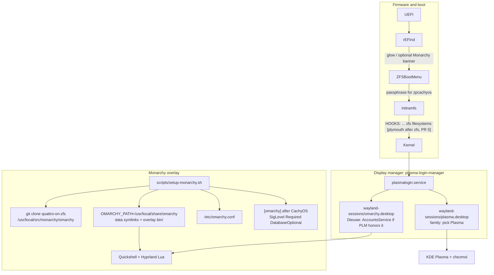
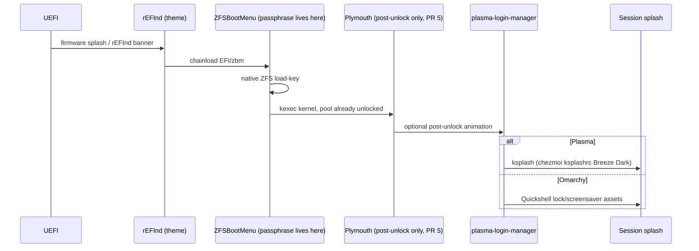

# Monarchy: Omarchy Quattro as an optional desktop on CachyOS+ZFS+KDE

- **Author:** TBD (Dieuwe)
- **Date:** 2026-08-26
- **Status:** Implementation (PR 2 scripts in tree; first apply is an older laptop, not kingfisher)
- **Audience:** Senior engineers working in `dieuwedeboer/dotfiles`
- **Machines in scope:** bring-up on an older laptop first. kingfisher (Gigabyte B550 / Ryzen 5 5600X) is for build and review only. bonw9 (System76 Bonobo WS / Haswell i7-4810MQ + GTX 970M) after the laptop. Then any future CachyOS+ZFS+KDE box that follows `scripts/install.sh`

This document is the source of truth for Monarchy. Scripts live under `scripts/setup-monarchy.sh`. Apply refuses kingfisher and bonw9 unless `MONARCHY_ALLOW_HOST=1`.

---

## Overview

Dieuwe's household runs CachyOS on native-encrypted ZFS with KDE Plasma, rEFInd chainloading ZFSBootMenu, and a repeatable chezmoi/dotfiles install. That base install path does not change. Monarchy adds Omarchy Quattro (Hyprland 0.56 Lua + Quickshell) as an optional desktop environment on top of it.

Dieuwe's user defaults to the Omarchy/Hyprland session. Family users (`amie`, `olivier`) keep Plasma via the same greeter. They will see Omarchy in the session picker and must choose Plasma; that is required for a shared greeter. A bridging layer consumes `berenddeboer/omarchy` branch `quattro-on-zfs` as an `omarchy-dev-link`-style tree (clone plus `/etc/omarchy.conf`), plus official `[omarchy]` leaf packages, while refusing every Omarchy-native boot, kernel, ZFS-layout, and `pacman.conf` contract. The completed setup is named Monarchy.

The fork's ZFS support is real, but it is Omarchy-native ZFS (`zroot/ROOT/default`, Limine, archzfs, encrypted PAM homes). Dieuwe's machines will never match that contract. Monarchy treats the fork as the desktop+script upstream, not as an installer.

---

## Background and motivation

### Current state (verified on kingfisher, 2026-08-26)

| Layer | What is actually running |
| --- | --- |
| Distro | CachyOS rolling, repos `[cachyos-v3]`, `[cachyos-core-v3]`, `[cachyos-extra-v3]`, `[cachyos]`, `[core]`, `[extra]`, `[multilib]`. No pacman Include drop-ins |
| Kernel | CachyOS Calamares always ships both `linux-cachyos-zfs` (prebuilt kmod, loaded from `extramodules/zfs.ko.zst`) and `zfs-dkms` plus `zfs-utils` (CachyOS packager, not archzfs). kingfisher 2026-08-26: `linux-cachyos 7.1.4-1` + `linux-cachyos-zfs 7.1.4-1`. The dkms tree has `it87`, not zfs. Both packages are a base-install invariant. Do not remove either. Do not add archzfs |
| Root | Encrypted ZFS. Pool `zpcachyos`. Bootfs `zpcachyos/ROOT/cos/root`. Home `zpcachyos/ROOT/cos/home`. Also `varcache`, `varlog` |
| Boot | ESP at `/boot/efi` (vfat). rEFInd at `EFI/refind` with glow theme. ZFSBootMenu at `EFI/zbm`. Properties `org.zfsbootmenu:bootfs`, `rootprefix=root=ZFS=`, `commandline="rw quiet splash"` |
| Unlock | ZFSBootMenu prompts for the pool passphrase. Host mkinitcpio HOOKS are `(base udev autodetect microcode kms modconf block keyboard keymap consolefont zfs filesystems)`. No plymouth hook. `fsck` already removed by `scripts/install.sh`. Kingfisher already uses the README keyfile: `/etc/zfs/zroot.key` is listed in mkinitcpio `FILES`, so the host `zfs` hook does not prompt |
| Snapshots | `sanoid.timer` on `zpcachyos/ROOT/cos/home`. Pacman hook `misc/zfs-snapshot.hook` recursively snapshots `zpcachyos/ROOT/cos` as `pre-update-*`, keep 3. Bootable recovery is ZBM snapshot boot + clone/promote |
| Desktop | KDE Plasma Wayland. Display manager is **plasma-login-manager** (`plasmalogin.service`), an SDDM fork that KDE ships as the SDDM-compatible greeter (same `/usr/share/wayland-sessions/` discovery, tighter Plasma theming/KCM). We keep it. `sddm` is not installed. Session file: `/usr/share/wayland-sessions/plasma.desktop`. Leftover `/etc/sddm.conf.d/kde_settings.conf` has empty `[Autologin] User=` and is not the active DM; `monarchy_skip_autologin` still asserts both files |
| Greeter users | `dieuwe` (uid 1000, `/bin/fish`), `amie` (1001, bash), `olivier` (1002, bash) |
| Dotfiles | chezmoi from `chezmoi/`. emacs, fish + `cachyos-fish-config`, ghostty, starship, nvim, ksplash Breeze Dark. `cachy-update` is the OS updater; chezmoi also has an `arch-update` config file that is not a second updater |
| AUR helper | paru |
| Overlap already installed | docker, nvim, starship, kdenlive, obsidian, libreoffice-fresh, wl-clipboard, ufw, ghostty |
| Plymouth | Package installed, default theme `cachyos-bootanimation`. Not in the initramfs, so it does not run at boot today. Packaged `ShowDelay` default is already 0 |

`scripts/install.sh` is the idempotent post-Calamares entrypoint. It calls `setup-packages.sh`, chezmoi, rEFInd glow, emacs, services, per-machine hooks (`setup-kingfisher.sh` / `setup-bonw9.sh`), and `setup-zfs.sh`. Monarchy is **not** called from `install.sh`. Operators run `scripts/setup-monarchy.sh` afterwards. README points at it.

### Pain points this solves

1. Dieuwe wants Omarchy Quattro as *his* daily desktop without abandoning CachyOS, ZFS, or family Plasma logins.
2. Official Omarchy ISO is Limine + Btrfs + Snapper + a single-user seamless login. That is a different operating system, not a DE overlay.
3. `berenddeboer/omarchy` `quattro-on-zfs` is the only maintained Omarchy+ZFS tree, but it encodes `zroot/ROOT/default`, archzfs, Limine, and a `pacman.conf` replacement. Running it raw on these machines is a brick.
4. Prior art (`mroboff/omarchy-on-cachyos`, basecamp discussion #650) assumes Btrfs, no KDE coexistence, and "do not install GNOME or KDE". Household requirement is the opposite.

### What Quattro actually is (from `basecamp/omarchy` `quattro` + omarchy.org)

- Package-backed: `omarchy` + `omarchy-settings` from `https://pkgs.omarchy.org/stable/$arch`. Official `omarchy` 4.0.1 is a tagged stable commit, not quattro tip.
- Desktop: Hyprland 0.56 Lua config + Quickshell. Waybar, Walker, Mako, hyprlock, hypridle are gone.
- Greeter: SDDM (`sddm` is a first-class row in `install/omarchy-base.packages`). Session: `default/wayland-sessions/omarchy.desktop` launches `uwsm start -g -1 -e -D Hyprland hyprland.desktop`. Upstream file has no `DesktopNames=` and Comment `Omarchy Hyprland session managed by uwsm`.
- Updates: `omarchy update` owns `-Syu`, migrations (88 on quattro-on-zfs today), and an ALPM hook that *aborts* raw `pacman -Syu` unless `OMARCHY_UPDATE_PACMAN=1`. The hook `Depends = omarchy`, so it only exists if the metapackage is installed.
- ISO: Limine + Btrfs + Snapper. Hibernation is Btrfs-only.
- File layout contract (`docs/file-layout.md`): `OMARCHY_PATH` defaults to `/usr/share/omarchy` via `default/bash/env-bootstrap` unless `/etc/omarchy.conf` exists. UWSM loads `/usr/share/uwsm/env.d/10-omarchy`, which sources that bootstrap (hardcoded `/usr/share/omarchy/...` in the packaged file). `config/hypr/hyprland.lua` does `dofile($OMARCHY_PATH/default/hypr/bootstrap.lua)`. `default/hypr/autostart.lua` runs `omarchy-launch-shell`, which execs `quickshell -n -p "$OMARCHY_PATH/shell"`. `default/hypr/envs.lua` rebuilds PATH and prepends `$OMARCHY_PATH/bin`. `default/hypr/paths.lua` reads `os.getenv("OMARCHY_PATH")`.

### What the ZFS fork actually is (from `berenddeboer/omarchy` `quattro-on-zfs`)

Two commits on top of quattro:

- `c6947c66` Support Omarchy on ZFS roots
- `bfcaa06f` Teach the Quattro upgrade to keep ZFS packages

Concrete fork behavior, all verified in tree:

- `default/pacman/pacman-*.conf` inject `[omarchy-zfs]` (private overlay `berenddeboer/omarchy-zfs-pkgs`) above `[omarchy]`.
- `install/helpers/pacman.sh` `use_omarchy_pacman_config()` **copies** that file over `/etc/pacman.conf`, **replaces `/etc/pacman.d/mirrorlist`** with Omarchy's Arch mirror, and, on ZFS, appends `[archzfs]`.
- `bin/omarchy-refresh-pacman` calls that helper then `pacman -Syyuu`.
- `install/config/zfs.sh` assumes PAM `pam_zfs_key` homes at `$pool/data/home`, writes mkinitcpio HOOKS with plymouth *before* zfs, enables `zfs-import-cache`, masks `tmp.mount`.
- `bin/omarchy-upgrade-to-quattro-zfs-check` **fails** unless root is `zroot/ROOT/default`, home is `zroot/data/home/$user` (encrypted, `keylocation=prompt`), `/boot` is a writable vfat ESP, Limine cmdline has `root=ZFS=zroot/ROOT/default zfs_boot_only=1`, and `zfs-utils` + `zfs-dkms` + `[archzfs]` are present.
- `bin/omarchy-snapshot create` is layout-agnostic (uses `findmnt SOURCE /`). `restore` on ZFS exits 2 ("not supported").
- Private overlay packages, split:

| Package | Hard depends | Why it is still forbidden |
| --- | --- | --- |
| `omarchy-dev` | `limine`, `limine-mkinitcpio-hook`, `limine-snapper-sync`, `snapper`, `sddm`, `hyprland`, `quickshell`, `uwsm`, `omarchy-settings-dev`, plus ALPM guard `00-omarchy-update-guard.hook` and `/usr/bin/omarchy-*` | Pulls a second bootloader and Snapper; ships the pacman-Syu abort hook |
| `omarchy-settings-dev` | `bash`, `curl`, `gum`, `hicolor-icon-theme`, `plymouth` only. limine/snapper are optdepends | `post_upgrade` `cp -f`s `/etc/os-release` to `NAME="Omarchy"`. Also ships `/usr/share/applications/mimeapps.list`, `/etc/sddm.conf.d/*`, `/etc/mkinitcpio.conf.d/omarchy_hooks.conf` (plymouth before encrypt/zfs on the Btrfs file; ZFS fork overwrites with plymouth-before-zfs), `/etc/docker/daemon.json`, `/etc/skel/.bashrc`, sudoers drop-ins, `/usr/lib/environment.d/*`, `/usr/local/share/wayland-sessions/omarchy.desktop` |

Never install either. Settings is dangerous *without* limine.

Trust the fork to keep Hyprland/Quickshell/omarchy scripts current. Do not adopt its boot or ZFS layout unless upstream generalizes those contracts (see [Upstream coexistence](#upstream-coexistence)).

---

## Goals and non-goals

### Goals

- Keep the CachyOS Calamares path: KDE Plasma, encrypted ZFS, rEFInd + ZFSBootMenu. `scripts/install.sh` remains the base and does not call Monarchy.
- Omarchy Quattro as an optional DE, installed by `scripts/setup-monarchy.sh`, idempotent, snapshot-first.
- Dieuwe's default session is Omarchy/Hyprland (AccountsService `Session=` if PR 3 proves PLM honors it; otherwise he picks Omarchy once). Family default is Plasma. Same greeter, no autologin. Family sees Omarchy in the picker and picks Plasma.
- Consume `berenddeboer/omarchy` `quattro-on-zfs` as an `omarchy-dev-link` tree (`/etc/omarchy.conf` + working prefix). Consume official `[omarchy]` for packages that do not fight CachyOS. Hyprland and Quickshell come from CachyOS first-match.
- Bridging layer with a denylist, an overlay `bin/`, and named functions for every blocker-class clash.
- Monarchy-branded boot/login splashes that do not steal the ZFS passphrase from ZFSBootMenu. Plymouth is PR 5, after the session works.
- Repeatable across current and future CachyOS+ZFS machines. Per-machine hooks stay in `setup-kingfisher.sh` / `setup-bonw9.sh`.
- Docs under `docs/` as listed below.

### Non-goals

- Replacing CachyOS with the Omarchy ISO, or dual-booting two roots.
- Renaming datasets to `zroot/ROOT/default` or moving the ESP to `/boot`.
- Switching kernel to `linux` / `linux-headers`, or ZFS provider to archzfs.
- Installing Limine, Snapper, `limine-snapper-sync`, or `sddm`. plasma-login-manager stays; it is the SDDM-compatible greeter CachyOS already runs.
- Removing `linux-cachyos-zfs` or `zfs-dkms`. CachyOS Calamares installs both on every machine.
- Removing Plasma (`pacman -Rns plasma` or equivalent).
- Seamless-login / autologin / Omarchy "direct boot".
- Vendoring a third Omarchy fork. If the berenddeboer fork stalls, we re-pin; we do not start `dieuwedeboer/omarchy`.
- Making Plymouth own the ZFS unlock prompt.
- Changing family users' shells, file manager, or Plasma look.
- Hibernation. Omarchy's setup is Btrfs+Limine only. Out of scope for v1.
- Shipping a custom ISO.
- Calling Monarchy from `scripts/install.sh`.

---

## Proposed design

### Architecture



CachyOS owns the OS: kernel, ZFS modules, repos, Plasma, `cachy-update`, sanoid, ZBM. Monarchy owns the Hyprland session, the clash bridge, and branding. Omarchy never owns `pacman.conf`, the bootloader, or `/etc/os-release`.

### Consume strategy

Dieuwe asked to use `berenddeboer/omarchy` `quattro-on-zfs` and trust it to stay current. The mechanism is the upstream **omarchy-dev-link model without installing `omarchy-dev`**: a git checkout, `/etc/omarchy.conf` pointing `OMARCHY_PATH` at a working prefix, and leaf packages. Not a blind `curl | bash` of the Omarchy installer, and not `pacman -S omarchy`.

#### Layer 1: official `[omarchy]` repo, appended, never replacing CachyOS

`monarchy_add_omarchy_repo` appends to `/etc/pacman.conf` only inside a marker block:

```ini
# BEGIN monarchy-omarchy
[omarchy]
SigLevel = Required DatabaseOptional
Server = https://pkgs.omarchy.org/stable/$arch
# END monarchy-omarchy
```

`SigLevel = Required DatabaseOptional` matches the rest of CachyOS `pacman.conf`. TrustAll is not accepted for v1. PR 2 installs the standalone `omarchy-keyring` package (GPG keyring files only, no limine/sddm depends) and locally signs `40DFB630FF42BCFFB047046CF0134EE680CAC571`. If keyring import fails on CachyOS, that is a bug to fix in PR 2, not a reason to fall back to TrustAll.

Order matters. Pacman uses the **first** match. CachyOS repos stay above `[omarchy]`, so `hyprland`, `quickshell`, `nvim`, `linux`, `zfs-utils` keep resolving from CachyOS/Arch. That is deliberate: Hyprland and Quickshell come from CachyOS. Packages that exist only in Omarchy (`omarchy-nvim`, `omacalc`, `omacut`, `omawrite`, `herdr`, `ttfx`, `tensaku`, `aether`, `omarchy-keyring`, …) resolve from `[omarchy]`.

Also:

- Do **not** add `[omarchy-zfs]`.
- Do **not** add `[archzfs]`.
- Do **not** replace `/etc/pacman.d/mirrorlist` or any `cachyos-*-mirrorlist`. `monarchy_preserve_pacman_conf` asserts those Include files still exist and that `[cachyos]` / `[cachyos-v3]` still precede `[omarchy]`.
- The append is in `pacman.conf` itself (CachyOS does not Include drop-ins). Re-running the script replaces the marker block in place.
- Take `/etc/pacman.conf.monarchy.bak` before the first edit. This repo is not "unused/harmless": `pacman -Sy` will see unique names. Overlay-bin fail-closed plus `packages.deny` are what keep those names off the machine.

#### Layer 2: git clone plus working prefix (accepted omarchy-dev-link model)

Not a git submodule. Two trees:

| Path | Role |
| --- | --- |
| `/usr/local/src/monarchy/omarchy` | Root-owned git clone of `berenddeboer/omarchy` `quattro-on-zfs`. Never on PATH. Never copied into `$HOME` |
| `/usr/local/share/omarchy` | `OMARCHY_PATH`. Working prefix the session actually reads |
| `/etc/omarchy.conf` | `OMARCHY_PATH=/usr/local/share/omarchy` (sourced by env-bootstrap) |
| `misc/monarchy/omarchy.lock` | Pin: remote, branch, commit, plus recorded `hyprland` and `quickshell` versions from CachyOS |

`/usr/local/share/omarchy` layout after `monarchy_sync_omarchy_clone` / `monarchy_rebuild_overlay`:

```text
/usr/local/share/omarchy/
  default     -> symlink to /usr/local/src/monarchy/omarchy/default
  shell       -> symlink to .../shell
  themes      -> symlink to .../themes
  migrations  -> symlink to .../migrations
  config      -> symlink to .../config
  install     -> symlink to .../install
  applications-> symlink to .../applications
  version     -> symlink to .../version
  bin/        -> OVERLAY directory (not a symlink to clone/bin)
    omarchy-refresh-pacman   # stub, mode 0755
    omarchy-menu             # symlink to clone/bin/omarchy-menu
    ...                      # only classified names
```

Clone `bin/` stays in the git tree and is **not** on PATH. env-bootstrap prepends `$OMARCHY_PATH/bin` whenever `OMARCHY_PATH != /usr/share/omarchy`. `envs.lua` prepends `$OMARCHY_PATH/bin` from `paths.lua`. Both therefore hit the overlay, not the raw clone. That is the control plane. PATH stubs in front of clone `bin/` cannot work: `envs.lua` would put clone `bin/` first.

`/etc/omarchy.conf`:

```bash
OMARCHY_PATH=/usr/local/share/omarchy
```

Monarchy UWSM drop-in `/usr/share/uwsm/env.d/10-monarchy` (sorts before a hypothetical packaged `10-omarchy`, which we never install) is the exact script in the API section. Do **not** install the clone's `default/uwsm/env.d/10-omarchy` unchanged: that file hardcodes `/usr/share/omarchy/default/bash/env-bootstrap`.

Dieuwe-only user files (PR 4b):

- Copy `config/hypr/*` into `~/.config/hypr/` so `hyprland.lua` can `dofile` bootstrap from `OMARCHY_PATH`.
- Seed `~/.config/omarchy/branding/` from clone `logo.txt` / `icon.txt`.
- Do **not** copy `default/`, `shell/`, or `bin/` into the home directory. Quickshell is launched with `-p "$OMARCHY_PATH/shell"`.

omarchy-settings files that must never land on disk:

- `/etc/os-release` override
- `/usr/share/applications/mimeapps.list`
- `/etc/mkinitcpio.conf.d/omarchy_hooks.conf`
- `/etc/sddm.conf.d/*`
- `/etc/skel/.bashrc` from Omarchy
- `/usr/lib/environment.d/*` Omarchy drop-ins
- `/etc/sudoers.d/omarchy-*`
- `/etc/docker/daemon.json` from Omarchy
- `/etc/profile.d/omarchy.sh` (would force OMARCHY_PATH on Plasma login shells)

#### Layer 3: never install the metapackages

`--assume-installed limine,snapper,...` is rejected. Dummy `Provides:` packages are rejected. Leaf packages from `install/omarchy-base.packages` minus `packages.deny` only.

#### Version lock and `--update`

`misc/monarchy/omarchy.lock` records:

```text
remote=https://github.com/berenddeboer/omarchy.git
branch=quattro-on-zfs
commit=<full sha>
hyprland=<pacman -Q hyprland>
quickshell=<pacman -Q quickshell>
```

`misc/monarchy/packages.installed` is written on first successful package install (one name per line). `--update` upgrades *that* set with `pacman -S --needed`, not a fresh read of `omarchy-base.packages`.

`setup-monarchy.sh --update` is not unattended apply:

1. Snapshot via `sudo /root/.local/bin/zfs-snapshot-pre-update.sh` (abort if the helper is missing; operator must have run `setup-zfs.sh`).
2. `git fetch` in the clone. Do not checkout yet.
3. `--check` dry-run (also available as `setup-monarchy.sh --check` without applying):
   - Clone `bin/` names **new relative to the lock** (not in the pinned `bin.allow` union `bin.deny` union `bin.wrap`): **fail closed**. Names already classified at the pin do not fail `--check`.
   - New rows in clone `omarchy-base.packages` vs `packages.deny` plus `packages.installed`: classify or fail.
   - Migrations in the new commit vs `migrations.deny` and a content pre-pass (limine, pacman.conf, snapper, sddm autologin, nvidia-dkms, os-release).
   - Recorded `hyprland` / `quickshell` vs live CachyOS versions: warn if CachyOS moved; **fail** if the fork's Quattro Lua requires a Hyprland ABI newer than installed (heuristic: clone `version` / changelog mention of a required Hyprland version greater than installed). Do not pull Hyprland from `[omarchy]` to "catch up."
4. Only then checkout, rebuild overlay, `pacman -S --needed` of `packages.installed`, filtered `omarchy-migrate`.

`[omarchy]` stable leaf packages are **not** required to match quattro-on-zfs tip. Hyprland/Quickshell come from CachyOS on purpose. The clone is allowed to be ahead of stable Omarchy packages; it is not allowed to be ahead of the installed compositor without a dry-run failure.

If the fork stalls, re-pin or temporarily track `basecamp/omarchy` `quattro` for scripts. Still never take their installer.

#### Why we do not vendor-fork Omarchy

1. Quattro is a moving target: 88 migrations, Hyprland Lua, a full Quickshell tree, hardware quirks for Framework/ASUS/T2. Tracking that is a second full-time distro.
2. `berenddeboer/omarchy` already exists as the ZFS-aware follow of quattro. Dieuwe's instruction is to trust it. A `dieuwedeboer/omarchy` would duplicate that and drift.
3. The delta we need is not inside Omarchy. It is a **policy layer** around Omarchy: refuse boot/ZFS/pacman ownership, overlay `bin/`. That layer belongs in this dotfiles repo.
4. If the fork dies, Monarchy still has official `[omarchy]` packages plus a lockfile commit.
5. `mroboff/omarchy-on-cachyos` patches Omarchy in-tree with `sed`. That bitrots on every Quattro file move. A classified overlay ages better.

### Overlay bin (runtime control plane)

Named functions are the *setup-time* contract. The overlay is the *runtime* contract. quattro-on-zfs `bin/` has **438** executables. Session PATH must not default-allow that tree.

`bin/omarchy` is the CLI router (`docs/cli-router.md`): `OMARCHY_BIN_DIR=$(dirname of this script)`, then `omarchy theme set` execs `$OMARCHY_BIN_DIR/omarchy-theme-set`. The overlay **must symlink clone `bin/omarchy`**. Wrapping `omarchy` as `--update` would break every spaced command (`omarchy menu`, `omarchy font set`, `omarchy update` dispatch). `omarchy update` (two words) is the router calling `omarchy-update`. Only that binary is wrapped.

Three checked-in inventories, complete at the pinned commit (`allow ∪ wrap ∪ deny` = every `clone/bin/*` name, 438 rows):

| File | Meaning | Overlay action |
| --- | --- | --- |
| `misc/monarchy/bin.allow` | Exact filenames, one per line. No globs | Symlink to clone `bin/<name>` |
| `misc/monarchy/bin.wrap` | Exact filenames | Install a wrapper, not the clone binary |
| `misc/monarchy/bin.deny` | Everything else (implicit deny) | Stub, exit 2, log |

PR 2 generates `bin.deny` as the complement of `bin.allow` ∪ `bin.wrap` at the lock commit and checks the three files in. Prose categories below are not the source of truth; the files are.

`monarchy_rebuild_overlay`:

1. Empty `/usr/local/share/omarchy/bin`.
2. For each name in `bin.deny`, install a stub of the same filename (exit 2, log to `/var/log/monarchy-setup.log`).
3. For each name in `bin.allow`, symlink to `/usr/local/src/monarchy/omarchy/bin/<name>`.
4. For each name in `bin.wrap`, install the Monarchy wrapper.
5. Install **deny stubs and wrap names also as `/usr/local/bin/<name>`** (mode 0755) so `sudo omarchy-refresh-pacman` cannot hit a clone binary. Arch `secure_path` includes `/usr/local/bin`. Do not install allowlisted binaries into `/usr/local/bin`.
6. If an allowlisted script execs `yay`, a `yay` wrapper in the overlay execs `paru` with a warning. `yay` is not an Omarchy `bin/` name.

`bin.wrap` (exact names):

- `omarchy-update` -> `setup-monarchy.sh --update`
- `omarchy-update-system-pkgs` -> `setup-monarchy.sh --update`

`omarchy-refresh-pacman` stays in `bin.deny` (exit 2). Its contract is "replace pacman.conf"; redirecting it to `--update` would hide that.

`--check` / `--update` fail **only** on clone `bin/` names that are **new relative to the lock** (not in the pinned allow ∪ wrap ∪ deny). Reclassifying a name is a deliberate file edit, not a `--check` failure.

`bin.allow` must include these exact names (autostart, nvidia Lua, bar, router). `default/hypr/autostart.lua` and `default/hypr/nvidia.lua` call them; nvidia.lua uses `$OMARCHY_PATH/bin/omarchy-hw-nvidia{,-gsp,-without-gsp}` by absolute path, so a name left in deny is a missing real binary (stub), not a PATH miss:

- `omarchy` (the CLI router; never a wrapper)
- `omarchy-launch-shell`
- `omarchy-powerprofiles-init`
- `omarchy-hyprland-monitor-watch`
- `omarchy-hook`
- `omarchy-bar` (`omarchy-refresh-shell` calls this)
- `omarchy-hw-nvidia`
- `omarchy-hw-nvidia-gsp`
- `omarchy-hw-nvidia-without-gsp`

Also in `bin.allow` by exact name, because the session and menu need them. This is the rest of the v1 allow seed; PR 2 writes each as its own line:

- `omarchy-menu`, `omarchy-launch-nautilus`, `omarchy-launch-terminal`, `omarchy-launch-browser`, `omarchy-launch-editor`, `omarchy-launch-screensaver`, `omarchy-refresh-hyprland`, `omarchy-refresh-shell`, `omarchy-refresh-config`, `omarchy-refresh-applications`, `omarchy-migrate`, `omarchy-snapshot`, `omarchy-default-terminal`, `omarchy-default-browser`, `omarchy-default-editor`, `omarchy-version`, `omarchy-cmd-present`, `omarchy-cmd-missing`, `omarchy-state`

Further session helpers (remaining `omarchy-menu-*`, `omarchy-launch-*` that do not shell out to a deny name, font/theme/notification/restart helpers) are added to `bin.allow` as **exact lines** when PR 2 builds the inventory. Anything not explicitly allowed is denied and stubbed.

Hard-deny names that must appear in `bin.deny` (never accidentally allow):

- `omarchy-refresh-pacman`
- `omarchy-refresh-limine`
- `omarchy-refresh-plymouth`
- `omarchy-plymouth-set`
- `omarchy-plymouth-set-by-theme`
- `omarchy-upgrade-to-quattro`
- `omarchy-upgrade-to-quattro-zfs-check`
- `omarchy-setup-direct-boot`
- `omarchy-hibernation-setup`
- `omarchy-system-factory-reset`
- `omarchy-system-factory-reset-finish`
- `omarchy-reinstall`
- `omarchy-reinstall-pkgs`
- `omarchy-reinstall-configs`
- `omarchy-channel-set`
- `omarchy-sudo-passwordless`
- `omarchy-provision-first-run`
- `omarchy-provision-user`
- `omarchy-provision-owner`
- `omarchy-refresh-sddm`

Install-script denylist (never invoked by the bridge, even if a binary of the same name is allowlisted):

- `install/helpers/pacman.sh` / `use_omarchy_pacman_config`
- `install/post-install/pacman.sh`
- `install/config/zfs.sh` and `install/config/zfs/*`
- `install/config/snapper.sh`
- `install/config/enable-services.sh`
- `install/config/firewall.sh`
- `install/hardware/nvidia.sh`
- `install/hardware/intel/ptl-kernel.sh`
- `install/hardware/network.sh`
- `install/hardware/fix-tuxedo-backlight.sh`
- `install/hardware/pacman.sh`
- `install/user/mise.sh`
- `install/user/all.sh` (would run mise). PR 4b calls `theme.sh`, `git.sh`, `xcompose.sh` individually.

`omarchy-provision-first-run` is stubbed. PR 4b also seeds `~/.local/state/omarchy/first-run-user` so a leaked copy no-ops.

Pre-seeded `misc/monarchy/migrations.deny` (clone today; content pre-pass still runs):

- `1784476564.sh`
- `1784917531.sh`
- `1785944594.sh`
- `1786482992.sh`
- `1786605598.sh`

All five call `limine-mkinitcpio`. Add any migration whose body matches `pacman.conf`, `omarchy-refresh-pacman`, `os-release`, `sddm`, `nvidia-dkms` as they appear.

### Bridging script

Entry point: `scripts/setup-monarchy.sh`. Same shape as `setup-packages.sh` / `setup-zfs.sh`: bash, `set -e`, `VERBOSE`, idempotent, sudo only where needed. **Not** invoked from `install.sh`.

```bash
# After a normal CachyOS+ZFS+KDE install and ./scripts/install.sh
./scripts/setup-monarchy.sh --check   # dry-run only
./scripts/setup-monarchy.sh           # install or reconcile
./scripts/setup-monarchy.sh --update  # fetch, dry-run, then apply
```

Layout:

```text
scripts/setup-monarchy.sh
scripts/lib/monarchy/
  common.sh              # logging, snapshot-first via installed helper
  pacman.sh              # monarchy_preserve_pacman_conf, monarchy_add_omarchy_repo
  denylist.sh            # loads packages.deny, bin.allow, bin.wrap, bin.deny, migrations.deny
  overlay.sh             # monarchy_rebuild_overlay
  packages.sh            # filtered install, writes packages.installed
  clone.sh               # monarchy_sync_omarchy_clone
  sessions.sh            # plasma-login-manager dual session
  portals.sh
  splash.sh
  nvidia.sh
  update.sh
  stubs/                 # stub templates copied into overlay bin and /usr/local/bin
misc/monarchy/
  omarchy.lock
  packages.deny
  packages.installed     # written on the machine, also copied back into git after PR 4a
  bin.allow              # exact names; no globs; includes omarchy router
  bin.wrap               # omarchy-update, omarchy-update-system-pkgs
  bin.deny               # complement at the pin (implicit deny, 438 total)
  migrations.deny
  branding/
docs/monarchy.md
docs/monarchy-install.md
docs/monarchy-clashes.md
```

There is no `packages.allow`. Filter is `omarchy-base.packages` minus `packages.deny` minus already-installed. `packages.installed` is the recorded result `--update` uses.

Snapshot-first always calls `sudo /root/.local/bin/zfs-snapshot-pre-update.sh`. That helper hard-codes `zpcachyos/ROOT/cos` (same as `monarchy_assert_zfs_layout`'s default). If the helper is absent, abort with "run scripts/setup-zfs.sh first". Do not invoke the chezmoi source path; the installed helper is what the pacman hook uses.

#### Named functions (blockers)

| Function | What it does |
| --- | --- |
| `monarchy_assert_zfs_layout` | Require `findmnt -o FSTYPE /` is `zfs` and `SOURCE` matches `zpcachyos/ROOT/cos/root` (or `$MONARCHY_ROOT_DATASET`). Refuse Btrfs/ext4. Refuse `zroot/ROOT/default` |
| `monarchy_preserve_pacman_conf` | Abort if `/etc/pacman.conf` lacks `[cachyos]` / `[cachyos-v3]` before `[omarchy]`. Assert `/etc/pacman.d/cachyos-v3-mirrorlist`, `cachyos-mirrorlist`, and Arch `mirrorlist` still exist and are Included. Never copy Omarchy `pacman-*.conf` or Omarchy `mirrorlist-*` |
| `monarchy_add_omarchy_repo` | Idempotent marker-block append. Install `omarchy-keyring`. `SigLevel = Required DatabaseOptional`. `pacman -Sy` (not `-Syyuu`) |
| `monarchy_refuse_archzfs` | Fail if `[archzfs]` appears. Do not install archzfs keys |
| `monarchy_refuse_omarchy_zfs_repo` | Fail if `[omarchy-zfs]` is present |
| `monarchy_refuse_kernel_swap` | Never install `linux` / `linux-headers`. Assert running pkgbase is `linux-cachyos*` |
| `monarchy_refuse_bootloader` | Assert rEFInd at `/boot/efi/EFI/refind` and ZBM at `/boot/efi/EFI/zbm` (or `$MONARCHY_ZBM_DIR`). Refuse `limine*` packages. Overlay-stub `omarchy-refresh-limine` |
| `monarchy_refuse_snapper` | Refuse `snapper`. Keep sanoid + pacman hook |
| `monarchy_refuse_dataset_rename` | Never run `install/config/zfs.sh`. Never write `/etc/pam.d/zfs-key` |
| `monarchy_disable_omarchy_update_guard` | Never install `omarchy` / `omarchy-dev`. If the hook appears, mask it |
| `monarchy_keep_plasmalogin` | Assert `systemctl is-enabled plasmalogin`. Assert `sddm` is **not installed**. Never `systemctl enable sddm`. `sddm` is in `packages.deny` as a hard assert, not "install if a dependency requires it" |
| `monarchy_install_omarchy_session` | Install Monarchy-authored `/usr/share/wayland-sessions/omarchy.desktop` (not a blind copy of the clone) |
| `monarchy_skip_autologin` | Assert no `[Autologin] User=` in `/etc/plasmalogin.conf`, `/etc/plasmalogin.conf.d/*`, and leftover `/etc/sddm.conf.d/*` |
| `monarchy_skip_plymouth_zfs` | Never install AUR `plymouth-zfs`. Never put plymouth *before* the zfs hook |
| `monarchy_skip_os_release_clobber` | Never install `omarchy-settings*`. If `/etc/os-release` `ID` is not `cachyos`, abort and restore from `/usr/lib/os-release` |
| `monarchy_keep_family_mime` | Do not install Omarchy mimeapps system-wide or into `~/.config/mimeapps.list`. Hyprland keybinds launch Nautilus explicitly |
| `monarchy_rebuild_overlay` | Rebuild overlay `bin/` fail-closed |
| `monarchy_nvidia_keep_chwd` | Never run Omarchy `nvidia.sh` |
| `monarchy_refuse_daily_driver` | Refuse apply on kingfisher/bonw9 unless `MONARCHY_ALLOW_HOST=1`. `--check` is allowed |

### Dual-session design

**Decision: keep plasma-login-manager. Do not switch the household to SDDM.**

plasma-login-manager is KDE's SDDM fork (Plasma 6.6+). Feature-compatible for what we need: it reads `/usr/share/wayland-sessions/` and can start a non-Plasma Wayland session. Tighter coupling is the greeter UI, wallpaper KCM, and System Settings module. We are keeping Plasma, so that coupling is wanted.

Live evidence: kingfisher runs `plasmalogin.service` (`plasma-login-manager 6.7.2-2`). `sddm` is not installed. CachyOS KDE on this machine uses plasma-login-manager (display-manager symlink dated 2026-01-28).

`sddm` is denied as a package because a second display manager is a brick, not because PLM cannot list Omarchy. If a later leaf grows a hard sddm depend, `--check` fails.

```mermaid
sequenceDiagram
  participant User
  participant PLM as plasma-login-manager
  participant Plasma as startplasma-wayland
  participant Omarchy as uwsm + Hyprland + Quickshell
  User->>PLM: pick user + session
  alt family user chooses plasma
    PLM->>Plasma: plasma.desktop
    Plasma->>Plasma: XDG_CURRENT_DESKTOP=KDE, portal=kde
  else Dieuwe chooses omarchy
    PLM->>Omarchy: omarchy.desktop
    Omarchy->>Omarchy: XDG_CURRENT_DESKTOP=Hyprland, portal=hyprland;gtk
  end
```

Exact greeter files:

| File | Policy |
| --- | --- |
| `/usr/share/wayland-sessions/omarchy.desktop` | Monarchy-authored. `TryExec=uwsm`. `DesktopNames=Hyprland`. Comment is Monarchy-branded, not the clone's. PR 3 Exec is `/usr/local/bin/monarchy-session-probe` (logs, exits 0 after writing a stamp) until PR 4a installs `hyprland.desktop`; PR 4a rewrites Exec to `uwsm start -g -1 -e -D Hyprland hyprland.desktop` |
| `/usr/share/wayland-sessions/plasma.desktop` | Untouched |
| `/etc/plasmalogin.conf` | Leave as wallpaper-only (`Image=...kingfishers-quang-nguyen.jpg`). Do not clobber. No Autologin drop-in under `/etc/plasmalogin.conf.d/` |
| `/var/lib/plasmalogin/state.conf` | SDDM-style **global** `[Last]` user+session. Do **not** write Dieuwe+omarchy here; that would preselect Omarchy when a family member is chosen next |
| `/var/lib/AccountsService/users/dieuwe` | **Attempt** `Session=omarchy.desktop` (create/merge). Not a verified plasma-login-manager API. ArchWiki documents PLM autologin via `/etc/plasmalogin.conf.d/`, not AccountsService. Package strings on kingfisher do not mention AccountsService. PR 3 must confirm the picker default per user after writing this file |
| `/var/lib/AccountsService/users/amie` and `olivier` | Attempt `Session=plasma.desktop` the same way. Does not hide Omarchy from the dropdown |
| leftover `/etc/sddm.conf.d/kde_settings.conf` | Assert `[Autologin] User` empty. Do not delete (inert) |

Family members will see "Omarchy (Hyprland uwsm)" in the picker. That is acceptable and required. A shared greeter cannot hide a wayland-session without per-user filters PLM does not document. They pick Plasma.

If PR 3 shows PLM honors AccountsService `Session=`, Dieuwe's picker default is Omarchy. If PLM ignores it, **fall back: Dieuwe picks Omarchy once** after install; global `[Last]` may drift; family uses the dropdown. Document whichever outcome in `docs/monarchy-install.md`. Do not treat AccountsService as a guaranteed API until that check lands. Do not enable Autologin to fake a default.

No `[Autologin]`. ZFS passphrase is at ZBM. User password is at the greeter.

Mime: do not copy Omarchy `mimeapps.list` into `~/.config` (user-global; would change Dieuwe's Plasma Dolphin/chrome defaults). Nautilus is installed for Hyprland keybinds (`omarchy-launch-nautilus`). Plasma keeps Dolphin as `inode/directory`.

Keep all KDE packages.

### xdg-desktop-portal

Both portals installed. Selection is session-scoped via `XDG_CURRENT_DESKTOP`:

| Session | `XDG_CURRENT_DESKTOP` | Portal config | Packages |
| --- | --- | --- | --- |
| Plasma | `KDE` | `/usr/share/xdg-desktop-portal/kde-portals.conf` already `default=kde` | `xdg-desktop-portal-kde` (present) |
| Omarchy | `Hyprland` (`default/hypr/envs.lua`) | `/usr/share/xdg-desktop-portal/hyprland-portals.conf` with `default=hyprland;gtk` | `xdg-desktop-portal-hyprland` + existing gtk |

Do not set those env vars in a systemd user environment that would leak into Plasma.

### Custom boot splashes (Monarchy)

Unlock ownership is the constraint. ZFSBootMenu is a **separate** image (`Components` in `/boot/efi/EFI/zbm`, `EFI.Enabled: false`). Plymouth would join the *host* initramfs. AUR `plymouth-zfs` exists to steal the prompt (`HOOKS=(... plymouth plymouth-zfs filesystems)`). We will not install it.

Kingfisher already has `/etc/zfs/zroot.key` in host initramfs `FILES`, so the host `zfs` hook does not prompt. ZBM remains the passphrase UI.

On a future box **without** the keyfile: the host `zfs` hook prompts on the console *before* plymouth starts (plymouth is after zfs). That can look like a "broken splash" rather than a second passphrase. Document it. Do not "fix" it with `plymouth-zfs`.

Plymouth is a Key Decision: do it in PR 5 after the session works. Branding assets (`banner.png`, plymouth theme, optional greeter jpg) are created in PR 5; they do not exist yet.



#### 1. rEFInd (already glow)

`scripts/setup-refind-theme.sh` still owns installing glow. Monarchy adds `misc/monarchy/branding/refind/banner.png` and a marker in `refind.conf` that does not fight `include themes/glow/theme.conf`.

#### 2. ZFSBootMenu

Live config: Components enabled, EFI UKI disabled, `SplashImage` unused. v1 copies `misc/monarchy/branding/zbm/splash.bmp` to `/etc/zfsbootmenu/splash.bmp` so it is ready if EFI is ever enabled. Do **not** enable `EFI.Enabled`. Passphrase stays the stock ZBM TUI.

#### 3. Plymouth (post-unlock, PR 5)

- Theme `misc/monarchy/branding/plymouth/` -> `/usr/share/plymouth/themes/monarchy/`. `plymouth-set-default-theme monarchy`.
- Insert `plymouth` **after** `zfs` and **before** `filesystems`. `mkinitcpio -P`. Never `generate-zbm` for this (ZBM is a separate image).
- Keep `quiet splash` on `org.zfsbootmenu:commandline`.
- Overlay-stub `omarchy-refresh-plymouth` / `omarchy-plymouth-set`. Do not set `ShowDelay` (packaged default is already 0).

#### 4. Greeter

Leave the kingfisher wallpaper. Optional extra file under `/var/lib/plasmalogin/wallpapers/monarchy.jpg` is not forced. Do not install Omarchy's SDDM theme as the active greeter.

#### 5. Session splashes

Plasma: keep chezmoi `ksplashrc`. Omarchy: Quickshell lock + branding in `~/.config/omarchy/branding/` for Dieuwe only.

#### Asset map and deploy

| Asset | Repo path | Deploy path | Deployed by |
| --- | --- | --- | --- |
| rEFInd banner | `misc/monarchy/branding/refind/banner.png` | `/boot/efi/EFI/refind/themes/monarchy/banner.png` | `monarchy_splash_refind` (PR 5) |
| ZBM BMP | `misc/monarchy/branding/zbm/splash.bmp` | `/etc/zfsbootmenu/splash.bmp` | `monarchy_splash_zbm` (PR 5) |
| Plymouth theme | `misc/monarchy/branding/plymouth/*` | `/usr/share/plymouth/themes/monarchy/` | `monarchy_splash_plymouth` (PR 5) |
| Greeter wallpaper | `misc/monarchy/branding/greeter/monarchy.jpg` | `/var/lib/plasmalogin/wallpapers/monarchy.jpg` | optional, not default |
| Omarchy session desktop | `misc/monarchy/omarchy.desktop` (authored) | `/usr/share/wayland-sessions/omarchy.desktop` | `monarchy_install_omarchy_session` (PR 3) |
| Dieuwe Omarchy branding | clone `logo.txt` / `icon.txt` | `~/.config/omarchy/branding/` | PR 4b |

### Package install filter

`monarchy_install_packages` reads clone `install/omarchy-base.packages`, subtracts `misc/monarchy/packages.deny`, subtracts already installed, `pacman -S --needed --noconfirm`, writes `misc/monarchy/packages.installed`.

**Do not install from `omarchy-other.packages`.** Hardware stays CachyOS `chwd` + per-machine scripts.

v1 `packages.deny` (hard, checked in):

```text
sddm
tldr
yay
mise-bin
ufw-docker
snapper
limine
limine-mkinitcpio-hook
limine-snapper-sync
linux
linux-headers
linux-ptl
linux-ptl-headers
nvidia-dkms
nvidia-open-dkms
nvidia-580xx-dkms
nvidia-580xx-utils
lib32-nvidia-580xx-utils
tuxedo-drivers-nocompatcheck-dkms
zram-generator
omarchy
omarchy-dev
omarchy-settings
omarchy-settings-dev
kernel-modules-hook
btrfs-progs
```

`sddm` is a first-class `omarchy-base.packages` row. Denying it is what keeps a second DM off the box. `monarchy_keep_plasmalogin` asserts the package is absent.

`plymouth` stays off the deny list (already installed). `nautilus`, `chromium`, `foot`, `mpv` are installed (Hyprland session). `uwsm` is installed in PR 3.

---

## API / interface changes

No network API. Operator interfaces:

### `scripts/setup-monarchy.sh`

```text
usage: setup-monarchy.sh [--check] [--update] [--no-packages] [--splash-only] [-v]
```

| Flag | Behavior |
| --- | --- |
| `--check` | Snapshot-free dry-run of clone diff vs the lock inventories, package deny, migration pre-pass. Exit non-zero only on `bin/` names **new relative to the lock**, plus package/migration/ABI failures |
| (none) | Snapshot-first, clone pin, repo append, overlay, filtered packages (after PR 4a), session, portals |
| `--update` | Snapshot, fetch, `--check`, then apply |
| `--no-packages` | Config/session/overlay only |
| `--splash-only` | PR 5 branding + Plymouth HOOKS |

### Greeter session file (Monarchy-authored)

```ini
[Desktop Entry]
Name=Omarchy (Hyprland uwsm)
Comment=Monarchy session: Omarchy Quattro on CachyOS
Exec=/usr/local/bin/monarchy-session-probe
TryExec=uwsm
Type=Application
DesktopNames=Hyprland
```

PR 4a replaces `Exec=` with:

```ini
Exec=uwsm start -g -1 -e -D Hyprland hyprland.desktop
```

`monarchy-session-probe` writes `~/.local/state/monarchy/session-probe.log` and exits 0 so a greeter click in PR 3 is visible, not an opaque uwsm failure. Plasma's file is untouched.

### `/usr/share/uwsm/env.d/10-monarchy`

Shipped in PR 4a. Literal paths only: env-bootstrap reads `/etc/omarchy.conf` itself, so this file must not use `$OMARCHY_PATH` before that happens. Do not activate mise. User `TERMINAL=ghostty` comes from `~/.config/uwsm/env.d` (PR 4b), which UWSM loads after system `env.d`.

```bash
# /usr/share/uwsm/env.d/10-monarchy
# Monarchy UWSM env. Do not install upstream 10-omarchy (hardcodes
# /usr/share/omarchy/default/bash/env-bootstrap).

if [ -r /usr/local/share/omarchy/default/bash/env-bootstrap ]; then
  . /usr/local/share/omarchy/default/bash/env-bootstrap
fi

if [ -f /usr/local/share/omarchy/default/uwsm/default ]; then
  . /usr/local/share/omarchy/default/uwsm/default
else
  export TERMINAL=xdg-terminal-exec
  export EDITOR="omarchy-launch-editor --inline"
fi
```

---

## Data model changes

| Path | Purpose |
| --- | --- |
| `/etc/pacman.conf` marker block | `[omarchy]`, `SigLevel = Required DatabaseOptional` |
| `/etc/pacman.conf.monarchy.bak` | Backup before first edit |
| `/etc/omarchy.conf` | `OMARCHY_PATH=/usr/local/share/omarchy` |
| `/usr/local/src/monarchy/omarchy` | git clone |
| `/usr/local/share/omarchy` | working prefix: data symlinks + overlay `bin/` |
| `/usr/local/bin/omarchy-*` | deny stubs only (sudo-safe) |
| `/usr/share/uwsm/env.d/10-monarchy` | exact script in API section (literal env-bootstrap + uwsm/default) |
| `/usr/share/wayland-sessions/omarchy.desktop` | session |
| `/var/lib/AccountsService/users/{dieuwe,amie,olivier}` | attempted per-user default; PR 3 must verify PLM honors `Session=` |
| `/usr/share/xdg-desktop-portal/hyprland-portals.conf` | portal preference |
| `/usr/share/plymouth/themes/monarchy/` | splash (PR 5) |
| `misc/monarchy/omarchy.lock` | clone+hyprland+quickshell pin |
| `misc/monarchy/packages.installed` | recorded leaf set |
| `/root/.local/bin/zfs-snapshot-pre-update.sh` | existing helper; required |
| `/var/log/monarchy-setup.log` | setup + stub invocations |

ZFS datasets: **no changes**. Still `zpcachyos/ROOT/cos/{root,home,varcache,varlog}`.

Home encryption: pool-level encryption already covers `/home`. Do not migrate onto PAM `zroot/data/home/$user`.

---

## Package clash matrix

Sources compared:

- `berenddeboer/omarchy` `install/omarchy-base.packages` + `install/omarchy-other.packages`
- CachyOS KDE Calamares set (live kingfisher + CachyOS desktop-deps KDE list)
- `scripts/setup-packages.sh`, `setup-kingfisher.sh`, `setup-bonw9.sh`
- Live packages: `linux-cachyos`, `linux-cachyos-zfs`, `zfs-dkms` (CachyOS packager), `tealdeer`, `paru`, `fish`, `cachyos-fish-config`

### Blocker

| Clash | Who owns it today | Severity | Bridging resolution | Named function |
| --- | --- | --- | --- | --- |
| `omarchy-refresh-pacman` replaces `/etc/pacman.conf` **and** `/etc/pacman.d/mirrorlist`, injects `[omarchy-zfs]` / `[archzfs]` | CachyOS | blocker | Never call those scripts. Marker-block `[omarchy]` only. Overlay-stub the command. Assert CachyOS mirrorlists still exist | `monarchy_preserve_pacman_conf`, `monarchy_add_omarchy_repo` |
| Kernel `linux` / `linux-headers` vs `linux-cachyos` + `linux-cachyos-zfs` | CachyOS | blocker | `packages.deny`. Do not run `ptl-kernel.sh` | `monarchy_refuse_kernel_swap` |
| ZFS provider: fork wants archzfs `zfs-dkms` + `[archzfs]`. CachyOS Calamares always installs both `linux-cachyos-zfs` (loaded kmod) and CachyOS `zfs-dkms` | CachyOS | blocker | Keep both CachyOS packages. Do not add `[archzfs]` | `monarchy_refuse_archzfs` |
| Bootloader: Limine+UKI vs rEFInd+ZBM, ESP at `/boot/efi` not `/boot` | Dieuwe | blocker | Never install limine*. Overlay-stub `omarchy-refresh-limine` | `monarchy_refuse_bootloader` |
| Snapper + `limine-snapper-sync` vs sanoid + `misc/zfs-snapshot.hook` | Dieuwe | blocker | Never install snapper. Recovery is ZBM | `monarchy_refuse_snapper` |
| ALPM `00-omarchy-update-guard.hook` (`Depends = omarchy`) aborts `cachy-update` | would be Omarchy | blocker | Never install `omarchy` / `omarchy-dev` | `monarchy_disable_omarchy_update_guard` |
| Dataset contract `zroot/ROOT/default` vs `zpcachyos/ROOT/cos/root`. zfs-check fails here | Dieuwe / Calamares | blocker | Never run zfs.sh / zfs-check / quattro upgrade | `monarchy_refuse_dataset_rename` |
| `omarchy-settings` / `omarchy-settings-dev` `cp -f` `/etc/os-release` (no limine depend required) | CachyOS | blocker | Never install either settings package | `monarchy_skip_os_release_clobber` |
| `omarchy-dev` hard-depends on limine+snapper+sddm and ships `/usr/bin/omarchy-*` plus the ALPM guard | n/a | blocker | Never install it. Overlay bin replaces `/usr/bin/omarchy-*` | `monarchy_rebuild_overlay` |
| `sddm` in `omarchy-base.packages`; live DM is plasmalogin | CachyOS | blocker | `packages.deny` includes `sddm`. Hard assert package absent | `monarchy_keep_plasmalogin` |

### Major

| Clash | Who owns it | Severity | Bridging resolution |
| --- | --- | --- | --- |
| `tldr` vs `tealdeer` | CachyOS | major | Deny `tldr`. Keep tealdeer |
| `yay` vs `paru` | Dieuwe | major | Deny `yay`. Overlay wrapper execs `paru` if an allowlisted script calls `yay` |
| bash vs fish + `cachyos-fish-config` | Dieuwe fish, family bash | major | Do not change login shells. Do not install Omarchy bashrc into `/etc/skel` |
| CachyOS shell config. #650 says remove it | Dieuwe | major | Keep the package. Do not follow #650 |
| `omarchy-nvim` vs `chezmoi/dot_config/nvim` | Dieuwe chezmoi | major | Install `omarchy-nvim` as its own app. Do not overwrite `~/.config/nvim` |
| `mise-bin` + `install/user/mise.sh` vs uv/pnpm/bun/pipx + curl-installed grok/opencode | Dieuwe | major | Deny `mise-bin`. Skip `mise.sh` |
| Plymouth hook vs current mkinitcpio | Dieuwe HOOKS | major | PR 5: plymouth **after** zfs only. Never `plymouth-zfs` |
| SDDM theme vs family greeter | CachyOS plasma-login-manager | major | Do not switch DM. Do not apply Omarchy SDDM theme |
| `xdg-desktop-portal-hyprland` vs kde | both | major | Install both. Session-scoped `XDG_CURRENT_DESKTOP` |
| `nautilus` vs Dolphin | Plasma mime | major | Install nautilus. Do not write user-global mimeapps. Hyprland keybinds open Nautilus |
| `ufw-docker` + `firewall.sh` enables ufw; kingfisher disables ufw | kingfisher | major | Deny `ufw-docker`. Never run `firewall.sh` |
| `/etc/docker/daemon.json` | Dieuwe (no file) | major | Do not install omarchy-settings. v1: leave daemon.json absent |
| NVIDIA 580xx-dkms vs CachyOS `chwd`. bonw9 GTX 970M is Maxwell per `setup-bonw9.sh` comments; **not live-verified** (this research box is kingfisher, no nvidia pkgs) | CachyOS chwd + bonw9 script | major | Never run Omarchy `nvidia.sh`. Validate on bonw9 after kingfisher |
| `tuxedo-drivers-nocompatcheck-dkms` vs `tuxedo-control-center-bin` | Dieuwe TCC | major | Script is vendor-gated TUXEDO/Slimbook; still deny the package and the script |

### Minor / coexistence

| Clash | Who owns it | Severity | Bridging resolution |
| --- | --- | --- | --- |
| starship, nvim, docker, docker-compose, kdenlive, obsidian, libreoffice-fresh, wl-clipboard, ufw, ghostty | both | minor | `--needed`. Keep Dieuwe's ghostty chezmoi config |
| chromium vs `google-chrome` | both | minor | Install chromium for Omarchy keybinds. Keep google-chrome. Do not change Plasma default browser |
| mpv vs vlc | both | minor | Install mpv. Keep vlc |
| foot vs ghostty | Dieuwe terminals | minor | Install foot (Omarchy `xdg-terminal-exec` list). Set Dieuwe's Omarchy default terminal to **ghostty** in PR 4b via `~/.config/uwsm/env.d` `TERMINAL=ghostty`. Ghostty is his daily driver; foot remains installed so stock keybinds do not 404 |
| pipewire, wireplumber, power-profiles-daemon | present | minor | No-op |
| cups / avahi | Omarchy enable-services | minor | Do not run enable-services.sh |
| `kernel-modules-hook` | Omarchy | minor | Denied |
| zoxide, fzf, eza, bat, fd, ripgrep | Omarchy | minor | Install |
| `uwsm` | required | minor | Install in PR 3 so the greeter can list the session |
| `quickshell`, `hyprland` | required | minor | Install from CachyOS first-match (live: `cachyos-extra-v3/hyprland 0.56.0-2.1`, `extra/quickshell 0.3.0-2`) |
| CachyOS Hyprland DE (Noctalia) | not installed | minor | Do not install |
| `zram-generator` | not on this ZFS box | minor | Denied |

---

## Repeatability

### New machine

1. CachyOS ISO, UEFI, Calamares: FAT32 ESP 1024MB at `/boot/efi`, encrypted ZFS, **KDE Plasma**. Do not pick "No Desktop". Do not pick CachyOS Hyprland.
2. Post-install ZBM properties as in README (`bootfs=zpcachyos/ROOT/cos/root`, `rootprefix=root=ZFS=`, `commandline="rw quiet splash"`).
3. rEFInd + `zfsbootmenu` + `generate-zbm` as in README.
4. Create family users. Enable CachyOS updater from the greeter if desired.
5. `git clone git@github.com:dieuwedeboer/dotfiles.git && ./scripts/install.sh` (this does **not** install Monarchy).
6. Optional: `./scripts/setup-monarchy.sh`
7. Reboot. If PR 3 verified AccountsService, Dieuwe's picker default is Omarchy; otherwise he picks Omarchy once. Family picks Plasma from the dropdown every time global `[Last]` has drifted.

### Existing machines

Same `setup-monarchy.sh`. Idempotent. Snapshot-first uses `/root/.local/bin/zfs-snapshot-pre-update.sh`. Per-machine scripts stay as they are.

**First apply is an older laptop.** kingfisher and bonw9 are blocked in `monarchy_refuse_daily_driver` (override `MONARCHY_ALLOW_HOST=1`). Build and `--check` happen on kingfisher. bonw9 extra validation after the laptop is stable: confirm `chwd` NVIDIA stack still loads after Hyprland. Do not let `nvidia-580xx-dkms` from `[omarchy]`/`extra` replace CachyOS packages. Maxwell GM204 notes are from `setup-bonw9.sh` comments, not live-verified on kingfisher.

### Updates

| Updater | Owns | Must not |
| --- | --- | --- |
| `cachy-update` / `pacman -Syu` | CachyOS kernel, ZFS modules, Plasma, already-installed leaf packages in the synced DBs | Be aborted by omarchy-update-guard. Swap kernel. Drop `[cachyos*]`. Replace mirrorlist |
| `./scripts/setup-monarchy.sh --update` | Fetch quattro-on-zfs, dry-run vs lock inventories, overlay rebuild, `pacman -S --needed` of `packages.installed`, filtered migrate | Call `omarchy-refresh-pacman`. Unfiltered `-Syyuu`. Fast-forward past `bin/` names new to the lock |

Channel: `[omarchy]` **stable**. Clone follows `quattro-on-zfs`. Those two are allowed to differ; Hyprland ABI is not.

---

## Docs to specify (later PRs)

| Path | Role |
| --- | --- |
| `docs/monarchy.md` | This design, after consensus |
| `docs/monarchy-install.md` | Operator steps, greeter dropdown warning, no-keyfile Plymouth UX, rollback via ZBM |
| `docs/monarchy-clashes.md` | Living clash matrix |
| `docs/monarchy-upstream.md` | Issue filed against the ZFS fork: pool name + bootloader coexistence |
| `README.md` | Short Monarchy pointer. Landed in PR 6, not PR 1 |

---

## Upstream coexistence

`install/config/zfs.sh` already takes `pool=${root_dataset%%/*}` from `findmnt`. `omarchy-snapshot create` already snapshots whatever `findmnt SOURCE /` returns. Snapper, hibernation, and `limine-snapper-sync` already no-op off Btrfs.

The remaining hardcoding that blocks CachyOS Calamares ZFS:

| Contract | Fork requires | Live here |
| --- | --- | --- |
| Root dataset | `zroot/ROOT/default` (`omarchy-upgrade-to-quattro-zfs-check`, upgrade snapshot) | `zpcachyos/ROOT/cos/root` |
| Pool name | `zroot` (check overwrites a non-zroot pool variable back to `zroot`) | `zpcachyos` |
| Bootloader | Limine UKI, `/boot/limine.conf`, `/etc/default/limine` with `root=ZFS=zroot/ROOT/default zfs_boot_only=1` | rEFInd + ZFSBootMenu |
| ESP | `/boot` is writable vfat | `/boot/efi` is vfat; `/boot` is on the ZFS root |

Smallest upstream change that would let our layout coexist:

1. Treat root dataset as discovered (`findmnt SOURCE /`), and `bootfs` as `zpool get bootfs` (or `org.zfsbootmenu:bootfs`), not a string compare to `zroot/ROOT/default`.
2. If `limine` / `limine-update` is missing, skip `omarchy-refresh-limine` the same way it already skips Snapper on non-Btrfs. Probe ZFSBootMenu (`generate-zbm` or `/boot/efi/EFI/zbm`) instead of requiring `/boot/limine.conf`.
3. ESP is whichever of `/boot` and `/boot/efi` is vfat.

That is the issue in `docs/monarchy-upstream.md`. Filed on `berenddeboer/omarchy-zfs-pkgs` because the omarchy fork has issues disabled.

Related, not the ask: `zfs.sh` still writes PAM homes at `$pool/data/home`, overwrites mkinitcpio with plymouth-before-zfs, and `use_omarchy_pacman_config` still wants `[archzfs]`. Our bridge keeps refusing those even if 1–3 land.

## Alternatives considered

### 1. Run the Omarchy ISO (or fork ISO) as the host OS

**Rejected.** Throws away CachyOS kernel/repos, ZBM recovery, sanoid, Calamares ZFS layout, and family Plasma.

### 2. `mroboff/omarchy-on-cachyos` style: clone official Omarchy and sed the installer

**Rejected as the architecture.** Useful as a clash checklist (tldr/tealdeer, paru/yay, skip limine). In-tree sed bitrots. No KDE coexistence. No ZFS.

### 3. Install `omarchy-dev` from `[omarchy-zfs]` with `--assume-installed limine,snapper,...`

**Rejected.** Settings scriptlet still clobbers os-release. ALPM guard still blocks CachyOS updates.

### 4. Vendor-fork `dieuwedeboer/omarchy`

**Rejected.** Policy layer belongs in dotfiles.

### 5. Switch the household greeter to SDDM

**Rejected for v1.** Fallback only if PR 3 shows plasma-login-manager cannot list `omarchy.desktop` even with `uwsm` installed.

### 6. TTY session switching instead of a greeter

**Rejected.** Worse UX for family.

### 7. `omarchy-dev-link` model without the `omarchy-dev` package

Install `omarchy-keyring`, clone quattro-on-zfs, write `/etc/omarchy.conf`, point `OMARCHY_PATH` at a working prefix whose `bin/` is a Monarchy overlay. Same idea as `omarchy-dev-link` / `omarchy-dev-unlink`, without pacman owning `/usr/share/omarchy` or pulling limine/sddm.

**Accepted.** This *is* Layer 2. Dummy Provides was considered and rejected; this is the non-package version and is what the runtime actually needs.

---

## Security and privacy

| Topic | Handling |
| --- | --- |
| ZFS passphrase | Stays at ZBM. Not duplicated into Plymouth. Kingfisher already has the host keyfile; Monarchy does not change it |
| Greeter autologin | Disabled. Assert plasmalogin and leftover sddm Autologin |
| Docker group | Dieuwe stays in docker (install.sh). Family is not added |
| `[omarchy]` SigLevel | `Required DatabaseOptional` after `omarchy-keyring`. TrustAll is not accepted. CachyOS first-match still protects `linux`/`glibc`/`zfs-utils` |
| Do not add `[omarchy-zfs]` | Avoids a second unsigned GitHub Releases repo |
| os-release clobber | Detect and abort |
| Omarchy sudoers drop-ins | Do not install |
| Overlay bin + `/usr/local/bin` stubs | Runtime deny, including sudo |
| Firewall | Do not apply Omarchy default-deny on kingfisher |
| `omarchy-system-factory-reset` | Stubbed |

Threat model is a household workstation. The serious failure mode is "Omarchy update ate CachyOS repos or the bootloader."

---

## Observability

- `setup-monarchy.sh` logs to stdout and `/var/log/monarchy-setup.log`.
- Every overlay stub appends one line when invoked.
- `--check` prints `bin/` names new relative to the lock, new package rows, and denied migrations.
- Epilogue lists latest `pre-update-*` snapshots, `plasmalogin` status, `wayland-sessions`, `findmnt /`, `OMARCHY_PATH`.
- `monarchy-session-probe` log proves greeter launch in PR 3.
- No new metrics daemon. Rollback is ZBM.

---

## Rollout plan

No feature flag service. The flag is "did you run `setup-monarchy.sh`".

1. Docs (PR 1).
2. Clone, `/etc/omarchy.conf`, overlay, `omarchy-keyring`, `[omarchy]` marker (PR 2). `--check` on kingfisher. Apply on the older laptop.
3. `uwsm` + session desktop (PR 3) on the laptop. Prove the greeter *lists* Omarchy. Confirm or drop AccountsService as the per-user default.
4. Leaf packages + overlay populated (PR 4a), then Dieuwe user config (PR 4b).
5. Splash (PR 5) after a known-good session.
6. bonw9 after the laptop is stable. Then README (PR 6).

Rollback: boot `zpcachyos/ROOT/cos/root@pre-update-*` from ZBM, or clone+promote. Pacman.conf backup at `/etc/pacman.conf.monarchy.bak`. `--uninstall` is not v1.

---

## Risks

| Risk | Severity | Mitigation |
| --- | --- | --- |
| Accidental `omarchy-refresh-pacman` or metapackage install | high | Overlay stubs, `/usr/local/bin` stubs, never install metapackage, `monarchy_preserve_pacman_conf`, pacman.conf bak |
| `omarchy-settings` rewrite of `/etc/os-release` | high | Never install it. Preflight `ID=cachyos` |
| Plymouth-before-zfs or `plymouth-zfs` | high | PR 5 only, after session; plymouth after zfs; no plymouth-zfs |
| `bin/` names new relative to the lock on `--update` | high | Fail closed; classify into allow, wrap, or deny before applying |
| plasma-login-manager does not list `omarchy.desktop` | medium | PR 3 installs `uwsm` and uses `TryExec=uwsm`. Fallback: SDDM without autologin |
| Hyprland + GTX 970M on bonw9 | medium | Do not run Omarchy nvidia.sh. Validate after kingfisher. Not live-verified here |
| Quattro migration touches limine/pacman/sddm | medium | Pre-seeded `migrations.deny` plus content pre-pass |
| Clone ahead of CachyOS Hyprland | medium | Lock triple; `--check` fails on ABI |
| Global greeter `[Last]` preselects Omarchy for family | medium | Do not write state.conf. Try AccountsService; if PR 3 shows PLM ignores it, Dieuwe picks Omarchy once. Document dropdown |
| Dual portals in the wrong session | low | Session-scoped `XDG_CURRENT_DESKTOP` |
| Nautilus vs Dolphin for Dieuwe's Plasma | low | No user-global mimeapps |

---

## Open questions

1. **Does plasma-login-manager honor AccountsService `Session=` for the per-user picker default?** Listing extra wayland sessions is the SDDM contract PLM inherits. Gated on PR 3 (`uwsm` installed, `TryExec=uwsm`, probe Exec). If the file is visible, do not switch to SDDM. If AccountsService does not change the picker default, fall back to Dieuwe picking Omarchy once. Full Hyprland login is PR 4a.

2. **Will `quattro-on-zfs` generalize pool name and bootloader?** Filed as https://github.com/berenddeboer/omarchy-zfs-pkgs/issues/1. Until that lands, the bridge keeps refusing Limine, archzfs, and `zroot/ROOT/default`. If they take the change, denylist and zfs-check stubs shrink.

Everything else that used to live here is a Key Decision: clone path, SigLevel, overlay-bin, Plymouth as PR 5, foot vs ghostty, family sees Omarchy, both CachyOS ZFS packages stay.

---

## References

- Local: `/home/dieuwe/dotfiles/README.md`, `scripts/install.sh`, `scripts/setup-packages.sh`, `scripts/setup-zfs.sh`, `scripts/setup-refind-theme.sh`, `scripts/setup-kingfisher.sh`, `scripts/setup-bonw9.sh`, `misc/sanoid.conf`, `misc/zfs-snapshot.hook`, `chezmoi/dot_config/{fish,nvim,kdedefaults/ksplashrc,arch-update}`
- https://github.com/berenddeboer/omarchy/tree/quattro-on-zfs (commits `c6947c66`, `bfcaa06f`; 88 migrations)
- https://github.com/berenddeboer/omarchy-zfs-pkgs (`omarchy-dev` vs `omarchy-settings-dev` PKGBUILDs)
- https://github.com/basecamp/omarchy/tree/quattro (`docs/file-layout.md`, `default/bash/env-bootstrap`, `default/hypr/{envs,paths,autostart}.lua`)
- https://omarchy.org and `manual/02-getting-started.md`, `manual/30-updates.md`, `docs/update-process.md`
- https://github.com/mroboff/omarchy-on-cachyos
- https://github.com/basecamp/omarchy/discussions/650
- ArchWiki Plasma Login Manager (sessions from `/usr/share/wayland-sessions/`, state at `/var/lib/plasmalogin/state.conf`)
- ArchWiki Plymouth; AUR `plymouth-zfs`
- ZFSBootMenu docs; live `/etc/zfsbootmenu/config.yaml`
- Live kingfisher facts: repos, `plasmalogin.service`, datasets, HOOKS, keyfile, users `dieuwe`/`amie`/`olivier`
- Plasma Login Manager (KDE SDDM fork): https://invent.kde.org/plasma/plasma-login-manager
- https://github.com/berenddeboer/omarchy-zfs-pkgs/issues/1 (pool name + skip-Limine coexistence)

---

## Key decisions

1. **CachyOS Calamares KDE+ZFS remains the only install path.** Monarchy is an optional overlay via `setup-monarchy.sh`, not a distro. `install.sh` does not call it. Family Plasma and ZBM recovery stay first-class.

2. **Consume `quattro-on-zfs` as a pinned git clone plus official `[omarchy]` leaf packages. Never install `omarchy`, `omarchy-dev`, `omarchy-settings`, or `omarchy-settings-dev`. Never add `[omarchy-zfs]` or `[archzfs]`.** The fork is trusted for script/QML currency. Its installer, pacman.conf, Limine, archzfs, and dataset names are not. `omarchy-dev` is the boot-stack+ALPM-guard package; `omarchy-settings-dev` is the os-release/mime/sddm/mkinitcpio scriptlet brick without limine depends.

3. **Do not vendor-fork Omarchy.** The durable piece is the overlay-bin policy layer in this repo.

4. **Keep plasma-login-manager, not SDDM.** It is KDE's SDDM-compatible greeter (same wayland-session discovery). `sddm` is in `packages.deny` so we never run two display managers. Shared greeter lists both sessions. No autologin.

5. **ZFSBootMenu keeps the passphrase. Plymouth is post-unlock only, and only in PR 5 after the session works.** No `plymouth-zfs`. No plymouth-before-zfs.

6. **CachyOS updater remains the OS updater.** Omarchy's ALPM guard and `omarchy-refresh-pacman` are forbidden. Overlay **symlinks** clone `bin/omarchy` (the CLI router). Only `omarchy-update` and `omarchy-update-system-pkgs` wrap `setup-monarchy.sh --update`. `omarchy update` (two words) is the router dispatching to that wrapper. `omarchy-refresh-pacman` is a deny stub (exit 2), not a wrapper.

7. **Datasets, kernel, bootloader, Snapper, os-release, and CachyOS mirrorlists are immovable.** The bridge asserts them and exits if drifted.

8. **NVIDIA and Tuxedo/Clevo quirks stay in `setup-bonw9.sh` / `chwd`.** Omarchy hardware scripts are denylisted. bonw9 Maxwell/580xx is from script comments, not live-verified on this host.

9. **Dieuwe's fish, paru, tealdeer, chezmoi nvim, ghostty, docker group membership, and kingfisher-disabled ufw stay.**

10. **Snapshot-first on every Monarchy apply/update**, via the installed helper `/root/.local/bin/zfs-snapshot-pre-update.sh`. Rollback is ZBM.

11. **Clone and `OMARCHY_PATH` are decided.** Git clone at `/usr/local/src/monarchy/omarchy`. Working prefix `OMARCHY_PATH=/usr/local/share/omarchy` via `/etc/omarchy.conf`. Data trees are symlinks into the clone. `bin/` is a Monarchy overlay, not clone `bin/`. This is the omarchy-dev-link model without the package.

12. **Runtime control plane is overlay-bin, fail-closed on names new to the lock.** Do not put clone `bin/` on PATH. `envs.lua` and env-bootstrap prepend `$OMARCHY_PATH/bin`; that directory is the overlay. At the pin, `bin.allow` ∪ `bin.wrap` ∪ `bin.deny` is a complete inventory of all 438 `bin/` names (implicit deny). `--check` fails only on names **new relative to the lock**. Autostart and nvidia Lua callees are exact `bin.allow` lines, not globs. Deny stubs and wrap names are also installed under `/usr/local/bin` for sudo.

13. **`[omarchy]` uses `SigLevel = Required DatabaseOptional` after installing `omarchy-keyring` in PR 2.** TrustAll is not accepted. The repo is not harmless just because CachyOS is first-match.

14. **Dieuwe's Plasma session does not inherit Hyprland mimeapps.** No system-wide or `~/.config/mimeapps.list` from Omarchy. Nautilus is a Hyprland keybind target only. Family Plasma is untouched.

15. **Hyprland and Quickshell come from CachyOS first-match, not from `[omarchy]`.** The lockfile records those versions next to the clone commit. `--update` fails if the fork requires a newer compositor ABI than CachyOS ships. `[omarchy]` stable leaves are not required to match quattro-on-zfs tip.

16. **Dieuwe's Omarchy default terminal is ghostty.** foot is still installed for stock Omarchy `xdg-terminal-exec`. Family sees Omarchy in the greeter and picks Plasma; that is required, not optional.

17. **CachyOS Calamares always installs both `linux-cachyos-zfs` and `zfs-dkms`.** Dotfiles assume both. Do not pick one. Do not add archzfs.

18. **Ask `quattro-on-zfs` to discover the live root dataset and skip Limine when ZFSBootMenu is already the boot path.** Issue text in `docs/monarchy-upstream.md`. Until they take it, Monarchy's denylist stays.

---

## PR plan

Each PR is independently reviewable and mergeable. Later PRs must not be required for earlier ones to be correct.

### PR 1: Docs, clash matrix, architecture

- **Title:** Add Monarchy design docs (Omarchy Quattro overlay on CachyOS+ZFS+KDE)
- **Files/components:** `docs/monarchy.md`, `docs/monarchy-clashes.md`, `docs/monarchy-install.md` (operator outline including greeter dropdown and no-keyfile Plymouth UX)
- **Dependencies:** none
- **Description:** Land the source of truth. No scripts, no package changes, no boot changes, **no README** (README is PR 6). Clash matrix includes enumerated `packages.deny` and overlay-bin rules.

### PR 2: Bridging skeleton, clone path, overlay, pacman, keyring

- **Title:** Add setup-monarchy.sh with omarchy-dev-link prefix, overlay bin, and signed [omarchy] repo
- **Files/components:** `scripts/setup-monarchy.sh`, `scripts/lib/monarchy/{common,pacman,denylist,overlay,clone,update}.sh`, `scripts/lib/monarchy/stubs/*`, `/etc/omarchy.conf` writer, `misc/monarchy/omarchy.lock` (initial pin including live hyprland/quickshell versions), `misc/monarchy/{packages.deny,bin.allow,bin.wrap,bin.deny,migrations.deny}` with a **complete** 438-name inventory at the pin
- **Dependencies:** PR 1
- **Description:** Clone to `/usr/local/src/monarchy/omarchy`. Build `/usr/local/share/omarchy` with data symlinks and an overlay `bin/` rebuilt from the inventories (`omarchy` router symlink included). Write `/etc/omarchy.conf`. Install `omarchy-keyring`. Append `[omarchy]` with `SigLevel = Required DatabaseOptional`. Assert CachyOS repos and mirrorlists. Install deny stubs and wrap names under `/usr/local/bin`. Generate `bin.deny` as the complement of allow ∪ wrap at the lock commit. `--check` fails only on names new relative to that lock. Does **not** install Hyprland. Cost of this PR: a signed extra repo plus a clone plus a full overlay. Not "unused/harmless."

### PR 3: Dual-session greeter (uwsm installed, session visible)

- **Title:** Register an Omarchy wayland session in plasma-login-manager
- **Files/components:** `scripts/lib/monarchy/sessions.sh`, `misc/monarchy/omarchy.desktop`, `/usr/local/bin/monarchy-session-probe`, AccountsService user files, autologin asserts
- **Dependencies:** PR 2
- **Description:** Install `uwsm` (tiny, extra) so `TryExec=uwsm` makes the session **visible**. Ship Monarchy-authored `omarchy.desktop` (`DesktopNames=Hyprland`, Monarchy Comment). Exec is `monarchy-session-probe` until PR 4a (picking it must not opaque-fail on missing `hyprland.desktop`). Do not use `TryExec=/usr/bin/true`. Write AccountsService `Session=` for dieuwe/amie/olivier **and confirm the picker default per user**. If PLM ignores that key, do not treat it as an API; fall back to Dieuwe picking Omarchy once and keep the family dropdown warning. Do not write global `state.conf`. Assert Autologin empty on plasmalogin and leftover sddm. Success criteria: (1) greeter *lists* Plasma and Omarchy, (2) per-user picker default is verified or the fallback is documented. SDDM fallback only if the file is invisible.

### PR 4a: Leaf packages, recorded set, overlay populated

- **Title:** Install Omarchy Quattro leaf packages and populate the overlay bin
- **Files/components:** `scripts/lib/monarchy/packages.sh`, `scripts/lib/monarchy/nvidia.sh`, `misc/monarchy/packages.installed` (written and committed after kingfisher apply), overlay rebuild (already have inventories from PR 2), rewrite `omarchy.desktop` Exec to `uwsm start … hyprland.desktop`, `/usr/share/xdg-desktop-portal/hyprland-portals.conf`, `/usr/share/uwsm/env.d/10-monarchy` (exact script in API section)
- **Dependencies:** PR 3
- **Description:** Filtered `omarchy-base.packages` minus `packages.deny`. Hyprland/Quickshell from CachyOS. No metapackages, no sddm, no yay/tldr/mise/ufw-docker/snapper/limine/nvidia-dkms. Rebuild overlay so allowlisted commands exist. kingfisher first. bonw9 NVIDIA is a note, not a chwd change.

### PR 4b: Dieuwe user config, first-run suppression

- **Title:** Seed Dieuwe's Hyprland config and suppress omarchy-provision-first-run
- **Files/components:** copy `config/hypr/*` into Dieuwe `~/.config/hypr/`, `~/.config/omarchy/branding/`, `~/.config/uwsm/env.d` (`TERMINAL=ghostty`), `~/.local/state/omarchy/first-run-user` marker, call `install/user/{theme,git,xcompose}.sh` only, `docs/monarchy-install.md` filled in
- **Dependencies:** PR 4a
- **Description:** Makes the session a real desktop for Dieuwe. Stubs already block `omarchy-provision-first-run`; the marker is belt and braces. No mimeapps.list in `~/.config`. No family home changes.

### PR 5: Monarchy splash and branding

- **Title:** Add Monarchy boot and login branding (rEFInd, ZBM BMP, post-unlock Plymouth)
- **Files/components:** `misc/monarchy/branding/**` (assets created here), `scripts/lib/monarchy/splash.sh`
- **Dependencies:** PR 4b (session works without splash; Plymouth HOOKS change is a reboot risk)
- **Description:** Create banner/plymouth/BMP assets. Deploy idempotently. Insert plymouth **after** zfs. `mkinitcpio -P`. Do not enable ZBM EFI UKI. Do not install plymouth-zfs. Do not replace the kingfisher greeter photo.

### PR 6: Per-machine validation notes and README

- **Title:** Document Monarchy bring-up on kingfisher and bonw9
- **Files/components:** `docs/monarchy-install.md` validation checklist, `README.md` Monarchy subsection, `docs/monarchy-clashes.md` updates from what PR 4a actually installed, optional comments in `setup-bonw9.sh` / `setup-kingfisher.sh` with no behavior change
- **Dependencies:** PR 4b (PR 5 nice-to-have)
- **Description:** Record NVIDIA/chwd expectations for bonw9 (not live-verified at design time), ufw-disabled for kingfisher, greeter dropdown for family, keyfile vs no-keyfile Plymouth UX, rollback via ZBM. This is the "we ran it" PR.
